# [📈 Live Status](https://demo.upptime.js.org): <!--live status--> **🟧 Partial outage**

This repository contains the open-source uptime monitor and status page for [Pergolas Valencia](https://pergolas-valencia.com/), powered by [Upptime](https://github.com/upptime/upptime).

With [Upptime](https://upptime.js.org), you can get your own unlimited and free uptime monitor and status page, powered entirely by a GitHub repository. We use [Issues](https://github.com/pmo-2025/status-pmo/issues) as incident reports, [Actions](https://github.com/pmo-2025/status-pmo/actions) as uptime monitors, and [Pages](https://demo.upptime.js.org) for the status page.

<!--start: status pages-->
<!-- This summary is generated by Upptime (https://github.com/upptime/upptime) -->
<!-- Do not edit this manually, your changes will be overwritten -->
<!-- prettier-ignore -->
| URL | Status | History | Response Time | Uptime |
| --- | ------ | ------- | ------------- | ------ |
|  [solucionas.es](https://solucionas.es) | 🟩 Up | [solucionas-es.yml](https://github.com/pmo-2025/status-pmo/commits/HEAD/history/solucionas-es.yml) | 

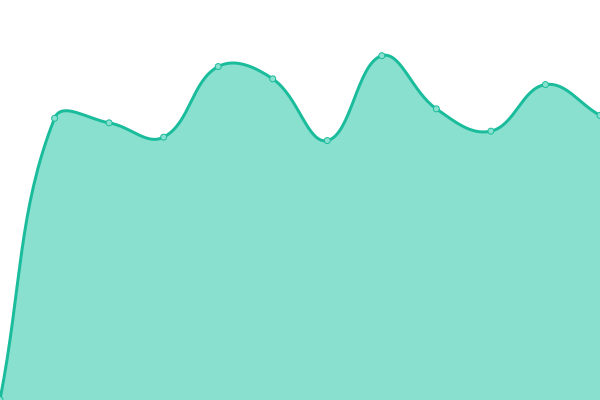 1282ms
     
 | 

<a href="https://demo.upptime.js.org/history/solucionas-es">100.00%</a>
    

|  [cerrajerosleon.com](https://cerrajerosleon.com) | 🟩 Up | [cerrajerosleon-com.yml](https://github.com/pmo-2025/status-pmo/commits/HEAD/history/cerrajerosleon-com.yml) | 

 1050ms
     
 | 

<a href="https://demo.upptime.js.org/history/cerrajerosleon-com">100.00%</a>
    

|  [reparacionelectrodomesticosleon.com](https://reparacionelectrodomesticosleon.com) | 🟩 Up | [reparacionelectrodomesticosleon-com.yml](https://github.com/pmo-2025/status-pmo/commits/HEAD/history/reparacionelectrodomesticosleon-com.yml) | 

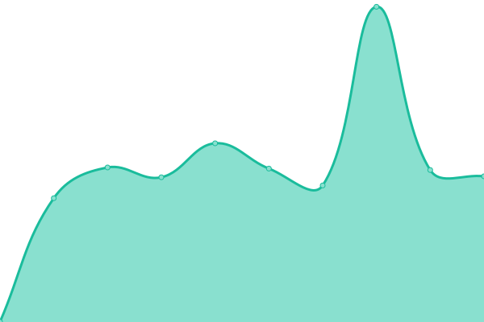 1094ms
     
 | 

<a href="https://demo.upptime.js.org/history/reparacionelectrodomesticosleon-com">100.00%</a>
    

|  [electricistasleon.com](https://electricistasleon.com) | 🟩 Up | [electricistasleon-com.yml](https://github.com/pmo-2025/status-pmo/commits/HEAD/history/electricistasleon-com.yml) | 

 901ms
     
 | 

<a href="https://demo.upptime.js.org/history/electricistasleon-com">100.00%</a>
    

|  [leonfontaneros.com](https://leonfontaneros.com) | 🟩 Up | [leonfontaneros-com.yml](https://github.com/pmo-2025/status-pmo/commits/HEAD/history/leonfontaneros-com.yml) | 

 1000ms
     
 | 

<a href="https://demo.upptime.js.org/history/leonfontaneros-com">100.00%</a>
    

|  [leondesatascos.com](https://leondesatascos.com) | 🟩 Up | [leondesatascos-com.yml](https://github.com/pmo-2025/status-pmo/commits/HEAD/history/leondesatascos-com.yml) | 

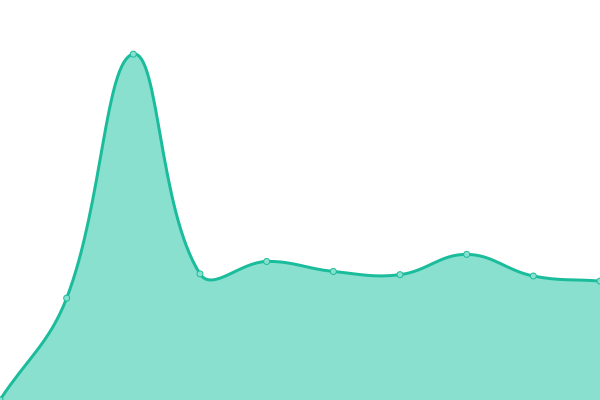 1086ms
     
 | 

<a href="https://demo.upptime.js.org/history/leondesatascos-com">100.00%</a>
    

|  [salamancacerrajeros.com](https://salamancacerrajeros.com) | 🟩 Up | [salamancacerrajeros-com.yml](https://github.com/pmo-2025/status-pmo/commits/HEAD/history/salamancacerrajeros-com.yml) | 

 1141ms
     
 | 

<a href="https://demo.upptime.js.org/history/salamancacerrajeros-com">100.00%</a>
    

|  [salamancafontaneros.com](https://salamancafontaneros.com) | 🟩 Up | [salamancafontaneros-com.yml](https://github.com/pmo-2025/status-pmo/commits/HEAD/history/salamancafontaneros-com.yml) | 

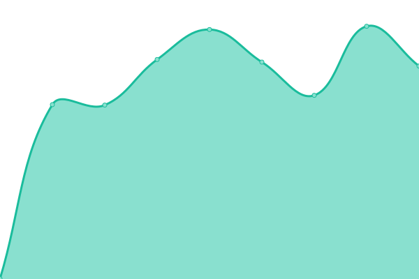 1091ms
     
 | 

<a href="https://demo.upptime.js.org/history/salamancafontaneros-com">100.00%</a>
    

|  [salamancadesatascos.com](https://salamancadesatascos.com) | 🟩 Up | [salamancadesatascos-com.yml](https://github.com/pmo-2025/status-pmo/commits/HEAD/history/salamancadesatascos-com.yml) | 

 1097ms
     
 | 

<a href="https://demo.upptime.js.org/history/salamancadesatascos-com">100.00%</a>
    

|  [salamancaelectricistas.com](https://salamancaelectricistas.com) | 🟩 Up | [salamancaelectricistas-com.yml](https://github.com/pmo-2025/status-pmo/commits/HEAD/history/salamancaelectricistas-com.yml) | 

 1135ms
     
 | 

<a href="https://demo.upptime.js.org/history/salamancaelectricistas-com">100.00%</a>
    

|  [reparacionelectrodomesticossalamanca.com](https://reparacionelectrodomesticossalamanca.com) | 🟩 Up | [reparacionelectrodomesticossalamanca-com.yml](https://github.com/pmo-2025/status-pmo/commits/HEAD/history/reparacionelectrodomesticossalamanca-com.yml) | 

 1100ms
     
 | 

<a href="https://demo.upptime.js.org/history/reparacionelectrodomesticossalamanca-com">100.00%</a>
    

|  [malagaelectricistas.com](https://malagaelectricistas.com) | 🟩 Up | [malagaelectricistas-com.yml](https://github.com/pmo-2025/status-pmo/commits/HEAD/history/malagaelectricistas-com.yml) | 

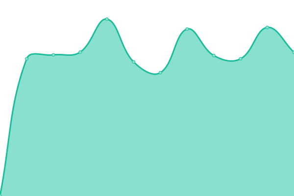 1143ms
     
 | 

<a href="https://demo.upptime.js.org/history/malagaelectricistas-com">100.00%</a>
    

|  [malagareparacionelectrodomesticos.com](https://malagareparacionelectrodomesticos.com) | 🟩 Up | [malagareparacionelectrodomesticos-com.yml](https://github.com/pmo-2025/status-pmo/commits/HEAD/history/malagareparacionelectrodomesticos-com.yml) | 

 1108ms
     
 | 

<a href="https://demo.upptime.js.org/history/malagareparacionelectrodomesticos-com">100.00%</a>
    

|  [malagacerrajeros.com](https://malagacerrajeros.com) | 🟩 Up | [malagacerrajeros-com.yml](https://github.com/pmo-2025/status-pmo/commits/HEAD/history/malagacerrajeros-com.yml) | 

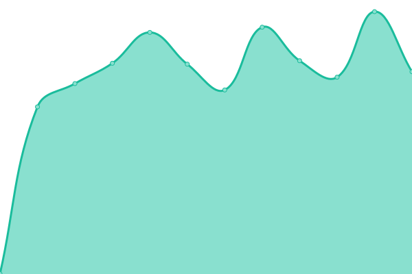 1123ms
     
 | 

<a href="https://demo.upptime.js.org/history/malagacerrajeros-com">100.00%</a>
    

|  [malagafontaneros.com](https://malagafontaneros.com) | 🟩 Up | [malagafontaneros-com.yml](https://github.com/pmo-2025/status-pmo/commits/HEAD/history/malagafontaneros-com.yml) | 

 1024ms
     
 | 

<a href="https://demo.upptime.js.org/history/malagafontaneros-com">100.00%</a>
    

|  [malagadesatascos.com](https://malagadesatascos.com) | 🟩 Up | [malagadesatascos-com.yml](https://github.com/pmo-2025/status-pmo/commits/HEAD/history/malagadesatascos-com.yml) | 

 1048ms
     
 | 

<a href="https://demo.upptime.js.org/history/malagadesatascos-com">100.00%</a>
    

|  [cerrajeroscadiz.com](https://cerrajeroscadiz.com) | 🟩 Up | [cerrajeroscadiz-com.yml](https://github.com/pmo-2025/status-pmo/commits/HEAD/history/cerrajeroscadiz-com.yml) | 

 1121ms
     
 | 

<a href="https://demo.upptime.js.org/history/cerrajeroscadiz-com">100.00%</a>
    

|  [reparacionelectrodomesticoscadiz.com](https://reparacionelectrodomesticoscadiz.com) | 🟩 Up | [reparacionelectrodomesticoscadiz-com.yml](https://github.com/pmo-2025/status-pmo/commits/HEAD/history/reparacionelectrodomesticoscadiz-com.yml) | 

 1126ms
     
 | 

<a href="https://demo.upptime.js.org/history/reparacionelectrodomesticoscadiz-com">100.00%</a>
    

|  [fontaneroscadiz.com](https://fontaneroscadiz.com) | 🟩 Up | [fontaneroscadiz-com.yml](https://github.com/pmo-2025/status-pmo/commits/HEAD/history/fontaneroscadiz-com.yml) | 

 1003ms
     
 | 

<a href="https://demo.upptime.js.org/history/fontaneroscadiz-com">100.00%</a>
    

|  [electricistascadiz.com](https://electricistascadiz.com) | 🟩 Up | [electricistascadiz-com.yml](https://github.com/pmo-2025/status-pmo/commits/HEAD/history/electricistascadiz-com.yml) | 

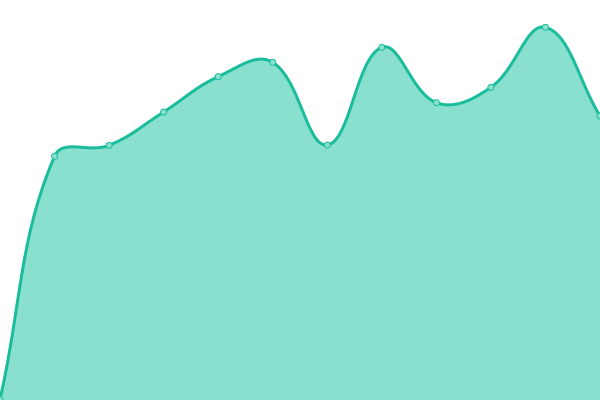 1082ms
     
 | 

<a href="https://demo.upptime.js.org/history/electricistascadiz-com">100.00%</a>
    

|  [cerrajeroscordoba.com](https://cerrajeroscordoba.com) | 🟩 Up | [cerrajeroscordoba-com.yml](https://github.com/pmo-2025/status-pmo/commits/HEAD/history/cerrajeroscordoba-com.yml) | 

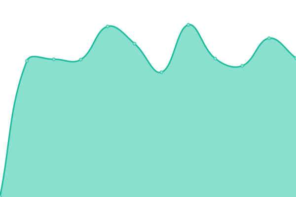 1103ms
     
 | 

<a href="https://demo.upptime.js.org/history/cerrajeroscordoba-com">100.00%</a>
    

|  [cordobadesatascos.com](https://cordobadesatascos.com) | 🟩 Up | [cordobadesatascos-com.yml](https://github.com/pmo-2025/status-pmo/commits/HEAD/history/cordobadesatascos-com.yml) | 

 1909ms
     
 | 

<a href="https://demo.upptime.js.org/history/cordobadesatascos-com">100.00%</a>
    

|  [electricistascordoba.com](https://electricistascordoba.com) | 🟩 Up | [electricistascordoba-com.yml](https://github.com/pmo-2025/status-pmo/commits/HEAD/history/electricistascordoba-com.yml) | 

 984ms
     
 | 

<a href="https://demo.upptime.js.org/history/electricistascordoba-com">100.00%</a>
    

|  [fontaneroscordoba.com](https://fontaneroscordoba.com) | 🟩 Up | [fontaneroscordoba-com.yml](https://github.com/pmo-2025/status-pmo/commits/HEAD/history/fontaneroscordoba-com.yml) | 

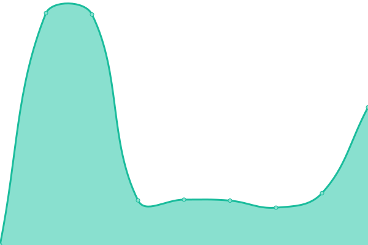 1360ms
     
 | 

<a href="https://demo.upptime.js.org/history/fontaneroscordoba-com">100.00%</a>
    

|  [reparacionelectrodomesticoscordoba.com](https://reparacionelectrodomesticoscordoba.com) | 🟩 Up | [reparacionelectrodomesticoscordoba-com.yml](https://github.com/pmo-2025/status-pmo/commits/HEAD/history/reparacionelectrodomesticoscordoba-com.yml) | 

 1214ms
     
 | 

<a href="https://demo.upptime.js.org/history/reparacionelectrodomesticoscordoba-com">100.00%</a>
    

|  [reparacionelectrodomesticosdonosti.com](https://reparacionelectrodomesticosdonosti.com) | 🟩 Up | [reparacionelectrodomesticosdonosti-com.yml](https://github.com/pmo-2025/status-pmo/commits/HEAD/history/reparacionelectrodomesticosdonosti-com.yml) | 

 1180ms
     
 | 

<a href="https://demo.upptime.js.org/history/reparacionelectrodomesticosdonosti-com">100.00%</a>
    

|  [cerrajerodonosti.com](https://cerrajerodonosti.com) | 🟩 Up | [cerrajerodonosti-com.yml](https://github.com/pmo-2025/status-pmo/commits/HEAD/history/cerrajerodonosti-com.yml) | 

 1580ms
     
 | 

<a href="https://demo.upptime.js.org/history/cerrajerodonosti-com">100.00%</a>
    

|  [donostiafontaneros.com](https://donostiafontaneros.com) | 🟩 Up | [donostiafontaneros-com.yml](https://github.com/pmo-2025/status-pmo/commits/HEAD/history/donostiafontaneros-com.yml) | 

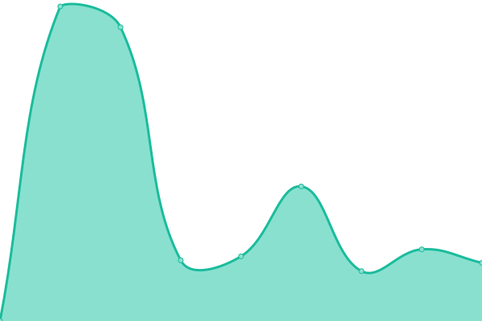 1730ms
     
 | 

<a href="https://demo.upptime.js.org/history/donostiafontaneros-com">100.00%</a>
    

|  [donostiaelectricistas.com](https://donostiaelectricistas.com) | 🟩 Up | [donostiaelectricistas-com.yml](https://github.com/pmo-2025/status-pmo/commits/HEAD/history/donostiaelectricistas-com.yml) | 

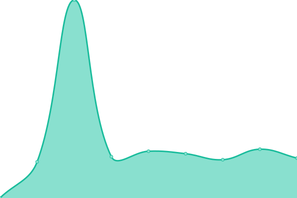 1644ms
     
 | 

<a href="https://demo.upptime.js.org/history/donostiaelectricistas-com">100.00%</a>
    

|  [desatascosdonosti.com](https://desatascosdonosti.com) | 🟩 Up | [desatascosdonosti-com.yml](https://github.com/pmo-2025/status-pmo/commits/HEAD/history/desatascosdonosti-com.yml) | 

 999ms
     
 | 

<a href="https://demo.upptime.js.org/history/desatascosdonosti-com">100.00%</a>
    

|  [electricistascoruna.com](https://electricistascoruna.com) | 🟩 Up | [electricistascoruna-com.yml](https://github.com/pmo-2025/status-pmo/commits/HEAD/history/electricistascoruna-com.yml) | 

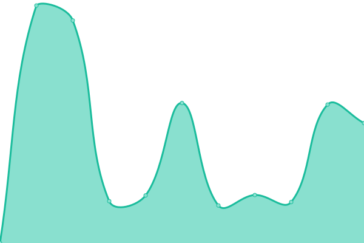 1675ms
     
 | 

<a href="https://demo.upptime.js.org/history/electricistascoruna-com">100.00%</a>
    

|  [fontaneroscoruna.com](https://fontaneroscoruna.com) | 🟩 Up | [fontaneroscoruna-com.yml](https://github.com/pmo-2025/status-pmo/commits/HEAD/history/fontaneroscoruna-com.yml) | 

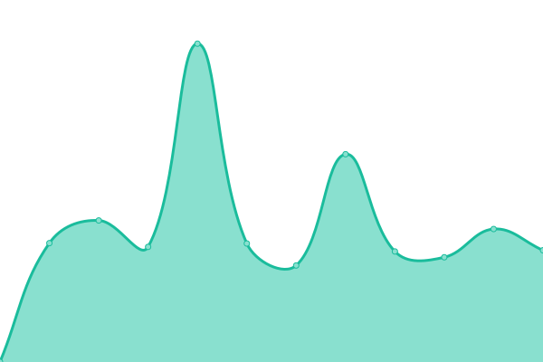 1170ms
     
 | 

<a href="https://demo.upptime.js.org/history/fontaneroscoruna-com">100.00%</a>
    

|  [cerrajeroscoruna.com](https://cerrajeroscoruna.com) | 🟩 Up | [cerrajeroscoruna-com.yml](https://github.com/pmo-2025/status-pmo/commits/HEAD/history/cerrajeroscoruna-com.yml) | 

 1465ms
     
 | 

<a href="https://demo.upptime.js.org/history/cerrajeroscoruna-com">100.00%</a>
    

|  [reparacionelectrodomesticoslacoruña.com](https://reparacionelectrodomesticoslacoruña.com) | 🟩 Up | [reparacionelectrodomesticoslacoruna-com.yml](https://github.com/pmo-2025/status-pmo/commits/HEAD/history/reparacionelectrodomesticoslacoruna-com.yml) | 

 1091ms
     
 | 

<a href="https://demo.upptime.js.org/history/reparacionelectrodomesticoslacoruna-com">100.00%</a>
    

|  [desatascos-coruña.com](https://desatascos-coruña.com) | 🟩 Up | [desatascos-coruna-com.yml](https://github.com/pmo-2025/status-pmo/commits/HEAD/history/desatascos-coruna-com.yml) | 

 971ms
     
 | 

<a href="https://demo.upptime.js.org/history/desatascos-coruna-com">100.00%</a>
    

|  [cerrajero-girona.com](https://cerrajero-girona.com) | 🟩 Up | [cerrajero-girona-com.yml](https://github.com/pmo-2025/status-pmo/commits/HEAD/history/cerrajero-girona-com.yml) | 

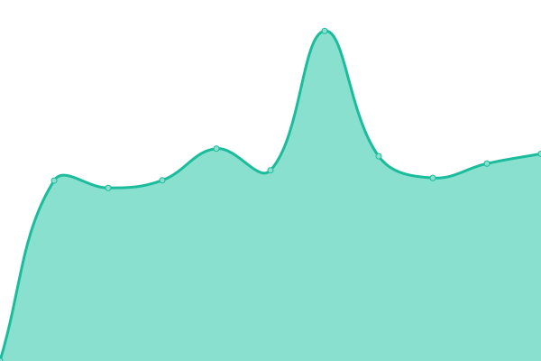 1106ms
     
 | 

<a href="https://demo.upptime.js.org/history/cerrajero-girona-com">100.00%</a>
    

|  [fontaneros-girona.com](https://fontaneros-girona.com) | 🟩 Up | [fontaneros-girona-com.yml](https://github.com/pmo-2025/status-pmo/commits/HEAD/history/fontaneros-girona-com.yml) | 

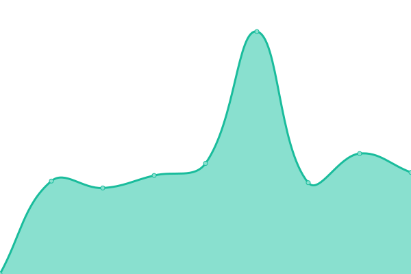 1072ms
     
 | 

<a href="https://demo.upptime.js.org/history/fontaneros-girona-com">100.00%</a>
    

|  [electricistas-girona.com](https://electricistas-girona.com) | 🟩 Up | [electricistas-girona-com.yml](https://github.com/pmo-2025/status-pmo/commits/HEAD/history/electricistas-girona-com.yml) | 

 994ms
     
 | 

<a href="https://demo.upptime.js.org/history/electricistas-girona-com">100.00%</a>
    

|  [reparacionelectrodomesticosgirona.com](https://reparacionelectrodomesticosgirona.com) | 🟩 Up | [reparacionelectrodomesticosgirona-com.yml](https://github.com/pmo-2025/status-pmo/commits/HEAD/history/reparacionelectrodomesticosgirona-com.yml) | 

 1162ms
     
 | 

<a href="https://demo.upptime.js.org/history/reparacionelectrodomesticosgirona-com">100.00%</a>
    

|  [desatascos-girona.com](https://desatascos-girona.com) | 🟩 Up | [desatascos-girona-com.yml](https://github.com/pmo-2025/status-pmo/commits/HEAD/history/desatascos-girona-com.yml) | 

 1088ms
     
 | 

<a href="https://demo.upptime.js.org/history/desatascos-girona-com">100.00%</a>
    

|  [cerrajerosvalladolid.com](https://cerrajerosvalladolid.com) | 🟩 Up | [cerrajerosvalladolid-com.yml](https://github.com/pmo-2025/status-pmo/commits/HEAD/history/cerrajerosvalladolid-com.yml) | 

 1257ms
     
 | 

<a href="https://demo.upptime.js.org/history/cerrajerosvalladolid-com">100.00%</a>
    

|  [fontanerosvalladolid.com](https://fontanerosvalladolid.com) | 🟩 Up | [fontanerosvalladolid-com.yml](https://github.com/pmo-2025/status-pmo/commits/HEAD/history/fontanerosvalladolid-com.yml) | 

 1372ms
     
 | 

<a href="https://demo.upptime.js.org/history/fontanerosvalladolid-com">100.00%</a>
    

|  [electricistasvalladolid.com](https://electricistasvalladolid.com) | 🟩 Up | [electricistasvalladolid-com.yml](https://github.com/pmo-2025/status-pmo/commits/HEAD/history/electricistasvalladolid-com.yml) | 

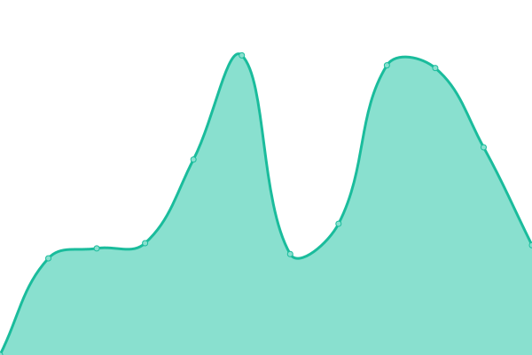 1211ms
     
 | 

<a href="https://demo.upptime.js.org/history/electricistasvalladolid-com">100.00%</a>
    

|  [valladoliddesatascos.com](https://valladoliddesatascos.com) | 🟩 Up | [valladoliddesatascos-com.yml](https://github.com/pmo-2025/status-pmo/commits/HEAD/history/valladoliddesatascos-com.yml) | 

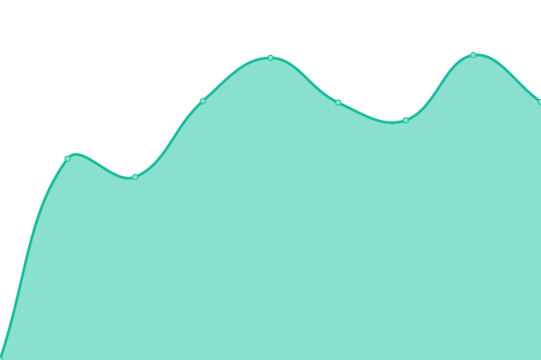 1011ms
     
 | 

<a href="https://demo.upptime.js.org/history/valladoliddesatascos-com">100.00%</a>
    

|  [reparacionelectrodomesticosvalladolid.com](https://reparacionelectrodomesticosvalladolid.com) | 🟩 Up | [reparacionelectrodomesticosvalladolid-com.yml](https://github.com/pmo-2025/status-pmo/commits/HEAD/history/reparacionelectrodomesticosvalladolid-com.yml) | 

 1101ms
     
 | 

<a href="https://demo.upptime.js.org/history/reparacionelectrodomesticosvalladolid-com">100.00%</a>
    

|  [alicantecerrajeros.com](https://alicantecerrajeros.com) | 🟩 Up | [alicantecerrajeros-com.yml](https://github.com/pmo-2025/status-pmo/commits/HEAD/history/alicantecerrajeros-com.yml) | 

 1449ms
     
 | 

<a href="https://demo.upptime.js.org/history/alicantecerrajeros-com">100.00%</a>
    

|  [alicantedesatascos.com](https://alicantedesatascos.com) | 🟩 Up | [alicantedesatascos-com.yml](https://github.com/pmo-2025/status-pmo/commits/HEAD/history/alicantedesatascos-com.yml) | 

 1188ms
     
 | 

<a href="https://demo.upptime.js.org/history/alicantedesatascos-com">100.00%</a>
    

|  [alicantefontaneros.com](https://alicantefontaneros.com) | 🟩 Up | [alicantefontaneros-com.yml](https://github.com/pmo-2025/status-pmo/commits/HEAD/history/alicantefontaneros-com.yml) | 

 1397ms
     
 | 

<a href="https://demo.upptime.js.org/history/alicantefontaneros-com">100.00%</a>
    

|  [alicanteelectricistas.com](https://alicanteelectricistas.com) | 🟩 Up | [alicanteelectricistas-com.yml](https://github.com/pmo-2025/status-pmo/commits/HEAD/history/alicanteelectricistas-com.yml) | 

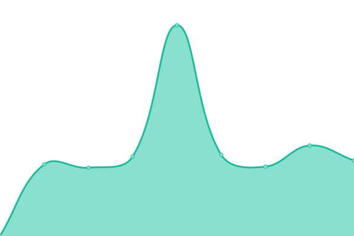 1585ms
     
 | 

<a href="https://demo.upptime.js.org/history/alicanteelectricistas-com">100.00%</a>
    

|  [alicantereparacionelectrodomesticos.com](https://alicantereparacionelectrodomesticos.com) | 🟩 Up | [alicantereparacionelectrodomesticos-com.yml](https://github.com/pmo-2025/status-pmo/commits/HEAD/history/alicantereparacionelectrodomesticos-com.yml) | 

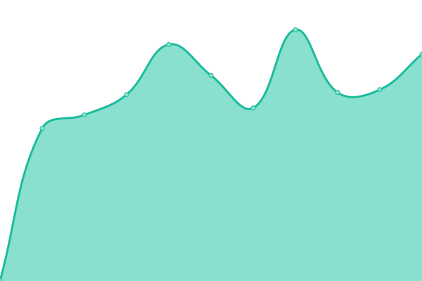 1059ms
     
 | 

<a href="https://demo.upptime.js.org/history/alicantereparacionelectrodomesticos-com">100.00%</a>
    

|  [valencia-desatascos.com](https://valencia-desatascos.com) | 🟩 Up | [valencia-desatascos-com.yml](https://github.com/pmo-2025/status-pmo/commits/HEAD/history/valencia-desatascos-com.yml) | 

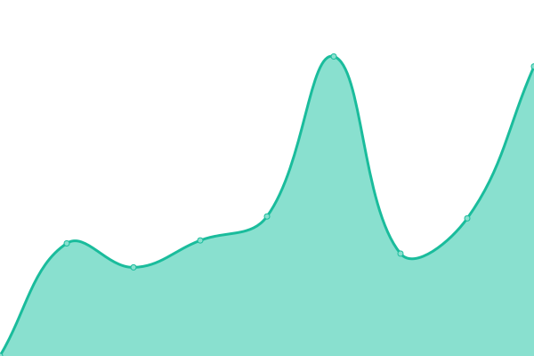 1468ms
     
 | 

<a href="https://demo.upptime.js.org/history/valencia-desatascos-com">100.00%</a>
    

|  [valenciafontaneros.com](https://valenciafontaneros.com) | 🟩 Up | [valenciafontaneros-com.yml](https://github.com/pmo-2025/status-pmo/commits/HEAD/history/valenciafontaneros-com.yml) | 

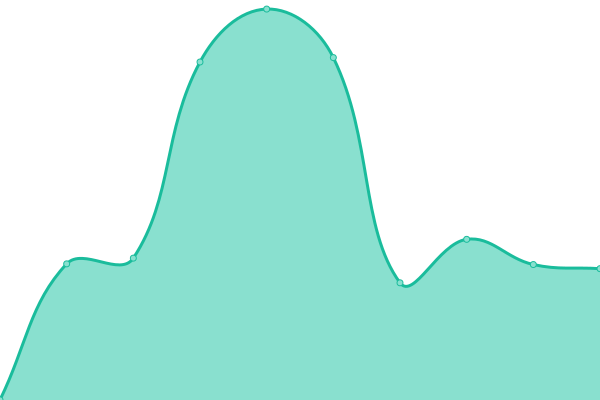 1415ms
     
 | 

<a href="https://demo.upptime.js.org/history/valenciafontaneros-com">100.00%</a>
    

|  [fontaneros-de-valencia.es](https://fontaneros-de-valencia.es) | 🟩 Up | [fontaneros-de-valencia-es.yml](https://github.com/pmo-2025/status-pmo/commits/HEAD/history/fontaneros-de-valencia-es.yml) | 

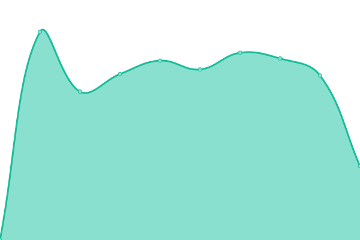 2457ms
     
 | 

<a href="https://demo.upptime.js.org/history/fontaneros-de-valencia-es">100.00%</a>
    

|  [fontaneros-de-valencia.com](https://fontaneros-de-valencia.com) | 🟩 Up | [fontaneros-de-valencia-com.yml](https://github.com/pmo-2025/status-pmo/commits/HEAD/history/fontaneros-de-valencia-com.yml) | 

 1806ms
     
 | 

<a href="https://demo.upptime.js.org/history/fontaneros-de-valencia-com">100.00%</a>
    

|  [valencia-fontaneros.com](https://valencia-fontaneros.com) | 🟩 Up | [valencia-fontaneros-com.yml](https://github.com/pmo-2025/status-pmo/commits/HEAD/history/valencia-fontaneros-com.yml) | 

 2457ms
     
 | 

<a href="https://demo.upptime.js.org/history/valencia-fontaneros-com">100.00%</a>
    

|  [valencia-fontaneros.es](https://valencia-fontaneros.es) | 🟩 Up | [valencia-fontaneros-es.yml](https://github.com/pmo-2025/status-pmo/commits/HEAD/history/valencia-fontaneros-es.yml) | 

 948ms
     
 | 

<a href="https://demo.upptime.js.org/history/valencia-fontaneros-es">100.00%</a>
    

|  [electricistasvalencia.com](https://electricistasvalencia.com) | 🟩 Up | [electricistasvalencia-com.yml](https://github.com/pmo-2025/status-pmo/commits/HEAD/history/electricistasvalencia-com.yml) | 

 1029ms
     
 | 

<a href="https://demo.upptime.js.org/history/electricistasvalencia-com">100.00%</a>
    

|  [reparaciónelectrodomésticosvalencia.com](https://reparaciónelectrodomésticosvalencia.com) | 🟩 Up | [reparacionelectrodomesticosvalencia-com.yml](https://github.com/pmo-2025/status-pmo/commits/HEAD/history/reparacionelectrodomesticosvalencia-com.yml) | 

 1478ms
     
 | 

<a href="https://demo.upptime.js.org/history/reparacionelectrodomesticosvalencia-com">100.00%</a>
    

|  [murciacerrajeros.com](https://murciacerrajeros.com) | 🟩 Up | [murciacerrajeros-com.yml](https://github.com/pmo-2025/status-pmo/commits/HEAD/history/murciacerrajeros-com.yml) | 

 1040ms
     
 | 

<a href="https://demo.upptime.js.org/history/murciacerrajeros-com">100.00%</a>
    

|  [desatascos-murcia24h.com](https://desatascos-murcia24h.com) | 🟩 Up | [desatascos-murcia24h-com.yml](https://github.com/pmo-2025/status-pmo/commits/HEAD/history/desatascos-murcia24h-com.yml) | 

 957ms
     
 | 

<a href="https://demo.upptime.js.org/history/desatascos-murcia24h-com">100.00%</a>
    

|  [murciareparacionelectrodomesticos.com](https://murciareparacionelectrodomesticos.com) | 🟩 Up | [murciareparacionelectrodomesticos-com.yml](https://github.com/pmo-2025/status-pmo/commits/HEAD/history/murciareparacionelectrodomesticos-com.yml) | 

 1081ms
     
 | 

<a href="https://demo.upptime.js.org/history/murciareparacionelectrodomesticos-com">100.00%</a>
    

|  [murciafontaneros.com](https://murciafontaneros.com) | 🟩 Up | [murciafontaneros-com.yml](https://github.com/pmo-2025/status-pmo/commits/HEAD/history/murciafontaneros-com.yml) | 

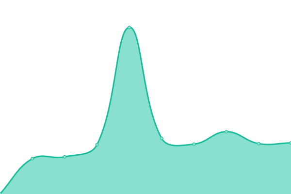 1241ms
     
 | 

<a href="https://demo.upptime.js.org/history/murciafontaneros-com">100.00%</a>
    

|  [electricistasenmurcia.com](https://electricistasenmurcia.com) | 🟩 Up | [electricistasenmurcia-com.yml](https://github.com/pmo-2025/status-pmo/commits/HEAD/history/electricistasenmurcia-com.yml) | 

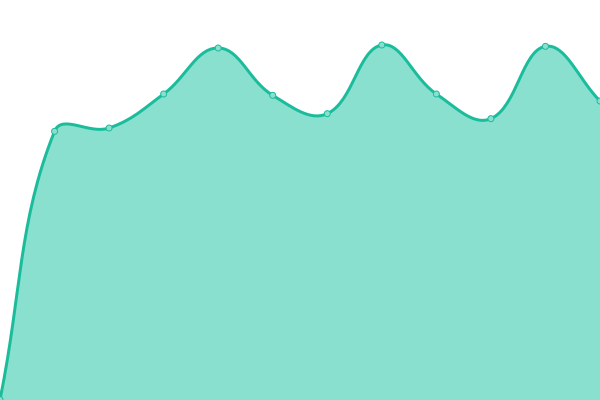 1122ms
     
 | 

<a href="https://demo.upptime.js.org/history/electricistasenmurcia-com">100.00%</a>
    

|  [granadacerrajeros.com](https://granadacerrajeros.com) | 🟩 Up | [granadacerrajeros-com.yml](https://github.com/pmo-2025/status-pmo/commits/HEAD/history/granadacerrajeros-com.yml) | 

 1025ms
     
 | 

<a href="https://demo.upptime.js.org/history/granadacerrajeros-com">100.00%</a>
    

|  [granadaelectricistas.com](https://granadaelectricistas.com) | 🟩 Up | [granadaelectricistas-com.yml](https://github.com/pmo-2025/status-pmo/commits/HEAD/history/granadaelectricistas-com.yml) | 

 917ms
     
 | 

<a href="https://demo.upptime.js.org/history/granadaelectricistas-com">100.00%</a>
    

|  [granadadesatascos.com](https://granadadesatascos.com) | 🟩 Up | [granadadesatascos-com.yml](https://github.com/pmo-2025/status-pmo/commits/HEAD/history/granadadesatascos-com.yml) | 

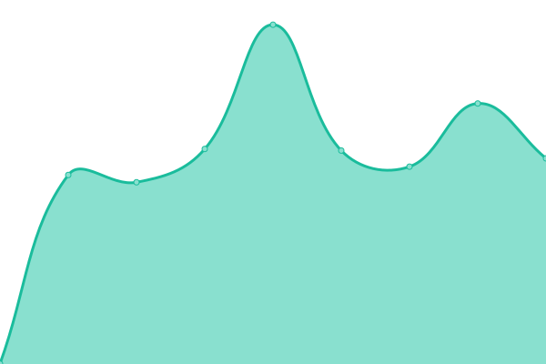 967ms
     
 | 

<a href="https://demo.upptime.js.org/history/granadadesatascos-com">100.00%</a>
    

|  [granadafontaneros.com](https://granadafontaneros.com) | 🟩 Up | [granadafontaneros-com.yml](https://github.com/pmo-2025/status-pmo/commits/HEAD/history/granadafontaneros-com.yml) | 

 924ms
     
 | 

<a href="https://demo.upptime.js.org/history/granadafontaneros-com">100.00%</a>
    

|  [reparacionelectrodomesticosgranada.com](https://reparacionelectrodomesticosgranada.com) | 🟩 Up | [reparacionelectrodomesticosgranada-com.yml](https://github.com/pmo-2025/status-pmo/commits/HEAD/history/reparacionelectrodomesticosgranada-com.yml) | 

 999ms
     
 | 

<a href="https://demo.upptime.js.org/history/reparacionelectrodomesticosgranada-com">100.00%</a>
    

|  [toledo-desatascos.com](https://toledo-desatascos.com) | 🟩 Up | [toledo-desatascos-com.yml](https://github.com/pmo-2025/status-pmo/commits/HEAD/history/toledo-desatascos-com.yml) | 

 908ms
     
 | 

<a href="https://demo.upptime.js.org/history/toledo-desatascos-com">100.00%</a>
    

|  [cerrajeros-toledo.com](https://cerrajeros-toledo.com) | 🟩 Up | [cerrajeros-toledo-com.yml](https://github.com/pmo-2025/status-pmo/commits/HEAD/history/cerrajeros-toledo-com.yml) | 

 1006ms
     
 | 

<a href="https://demo.upptime.js.org/history/cerrajeros-toledo-com">100.00%</a>
    

|  [fontaneros-toledo.com](https://fontaneros-toledo.com) | 🟩 Up | [fontaneros-toledo-com.yml](https://github.com/pmo-2025/status-pmo/commits/HEAD/history/fontaneros-toledo-com.yml) | 

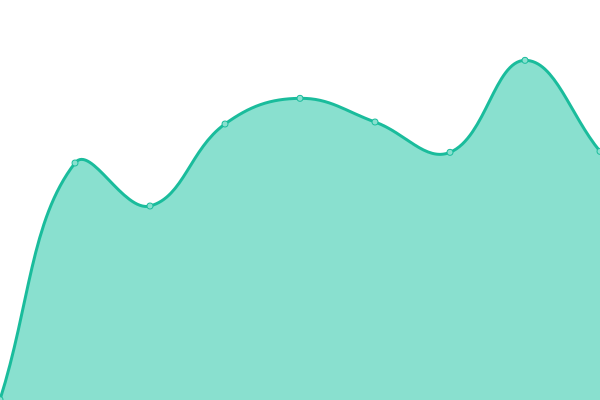 946ms
     
 | 

<a href="https://demo.upptime.js.org/history/fontaneros-toledo-com">100.00%</a>
    

|  [toledoelectricistas.com](https://toledoelectricistas.com) | 🟩 Up | [toledoelectricistas-com.yml](https://github.com/pmo-2025/status-pmo/commits/HEAD/history/toledoelectricistas-com.yml) | 

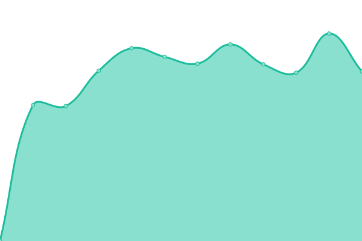 1035ms
     
 | 

<a href="https://demo.upptime.js.org/history/toledoelectricistas-com">100.00%</a>
    

|  [reparacionelectrodomesticostoledo.com](https://reparacionelectrodomesticostoledo.com) | 🟩 Up | [reparacionelectrodomesticostoledo-com.yml](https://github.com/pmo-2025/status-pmo/commits/HEAD/history/reparacionelectrodomesticostoledo-com.yml) | 

 1022ms
     
 | 

<a href="https://demo.upptime.js.org/history/reparacionelectrodomesticostoledo-com">100.00%</a>
    

|  [cerrajerosmallorca.com](https://cerrajerosmallorca.com) | 🟩 Up | [cerrajerosmallorca-com.yml](https://github.com/pmo-2025/status-pmo/commits/HEAD/history/cerrajerosmallorca-com.yml) | 

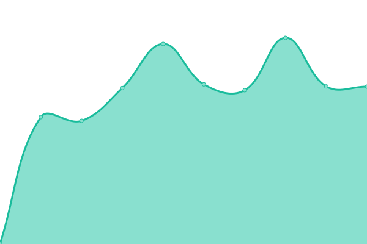 1033ms
     
 | 

<a href="https://demo.upptime.js.org/history/cerrajerosmallorca-com">100.00%</a>
    

|  [fontanerosmallorca.com](https://fontanerosmallorca.com) | 🟩 Up | [fontanerosmallorca-com.yml](https://github.com/pmo-2025/status-pmo/commits/HEAD/history/fontanerosmallorca-com.yml) | 

 915ms
     
 | 

<a href="https://demo.upptime.js.org/history/fontanerosmallorca-com">100.00%</a>
    

|  [electricistasmallorca.com](https://electricistasmallorca.com) | 🟩 Up | [electricistasmallorca-com.yml](https://github.com/pmo-2025/status-pmo/commits/HEAD/history/electricistasmallorca-com.yml) | 

 956ms
     
 | 

<a href="https://demo.upptime.js.org/history/electricistasmallorca-com">100.00%</a>
    

|  [desatascospalma.com](https://desatascospalma.com) | 🟩 Up | [desatascospalma-com.yml](https://github.com/pmo-2025/status-pmo/commits/HEAD/history/desatascospalma-com.yml) | 

 1052ms
     
 | 

<a href="https://demo.upptime.js.org/history/desatascospalma-com">100.00%</a>
    

|  [reparacionelectrodomesticosmallorca.com](https://reparacionelectrodomesticosmallorca.com) | 🟩 Up | [reparacionelectrodomesticosmallorca-com.yml](https://github.com/pmo-2025/status-pmo/commits/HEAD/history/reparacionelectrodomesticosmallorca-com.yml) | 

 1109ms
     
 | 

<a href="https://demo.upptime.js.org/history/reparacionelectrodomesticosmallorca-com">100.00%</a>
    

|  [reparacionelectrodomesticospalma.com](https://reparacionelectrodomesticospalma.com) | 🟩 Up | [reparacionelectrodomesticospalma-com.yml](https://github.com/pmo-2025/status-pmo/commits/HEAD/history/reparacionelectrodomesticospalma-com.yml) | 

 1003ms
     
 | 

<a href="https://demo.upptime.js.org/history/reparacionelectrodomesticospalma-com">100.00%</a>
    

|  [desatascos-tenerife.com](https://desatascos-tenerife.com) | 🟩 Up | [desatascos-tenerife-com.yml](https://github.com/pmo-2025/status-pmo/commits/HEAD/history/desatascos-tenerife-com.yml) | 

 941ms
     
 | 

<a href="https://demo.upptime.js.org/history/desatascos-tenerife-com">100.00%</a>
    

|  [cerrajerostenerife.com](https://cerrajerostenerife.com) | 🟩 Up | [cerrajerostenerife-com.yml](https://github.com/pmo-2025/status-pmo/commits/HEAD/history/cerrajerostenerife-com.yml) | 

 1049ms
     
 | 

<a href="https://demo.upptime.js.org/history/cerrajerostenerife-com">100.00%</a>
    

|  [fontanerostenerife.com](https://fontanerostenerife.com) | 🟩 Up | [fontanerostenerife-com.yml](https://github.com/pmo-2025/status-pmo/commits/HEAD/history/fontanerostenerife-com.yml) | 

 1006ms
     
 | 

<a href="https://demo.upptime.js.org/history/fontanerostenerife-com">100.00%</a>
    

|  [electricistastenerife.com](https://electricistastenerife.com) | 🟩 Up | [electricistastenerife-com.yml](https://github.com/pmo-2025/status-pmo/commits/HEAD/history/electricistastenerife-com.yml) | 

 1043ms
     
 | 

<a href="https://demo.upptime.js.org/history/electricistastenerife-com">100.00%</a>
    

|  [tenerifereparacionelectrodomesticos.com](https://tenerifereparacionelectrodomesticos.com) | 🟩 Up | [tenerifereparacionelectrodomesticos-com.yml](https://github.com/pmo-2025/status-pmo/commits/HEAD/history/tenerifereparacionelectrodomesticos-com.yml) | 

 922ms
     
 | 

<a href="https://demo.upptime.js.org/history/tenerifereparacionelectrodomesticos-com">100.00%</a>
    

|  [santandercerrajeros.com](https://santandercerrajeros.com) | 🟩 Up | [santandercerrajeros-com.yml](https://github.com/pmo-2025/status-pmo/commits/HEAD/history/santandercerrajeros-com.yml) | 

 1228ms
     
 | 

<a href="https://demo.upptime.js.org/history/santandercerrajeros-com">100.00%</a>
    

|  [desatascos-santander.com](https://desatascos-santander.com) | 🟩 Up | [desatascos-santander-com.yml](https://github.com/pmo-2025/status-pmo/commits/HEAD/history/desatascos-santander-com.yml) | 

 1055ms
     
 | 

<a href="https://demo.upptime.js.org/history/desatascos-santander-com">100.00%</a>
    

|  [electricistas-santander.com](https://electricistas-santander.com) | 🟩 Up | [electricistas-santander-com.yml](https://github.com/pmo-2025/status-pmo/commits/HEAD/history/electricistas-santander-com.yml) | 

 1031ms
     
 | 

<a href="https://demo.upptime.js.org/history/electricistas-santander-com">100.00%</a>
    

|  [santanderfontaneros.com](https://santanderfontaneros.com) | 🟩 Up | [santanderfontaneros-com.yml](https://github.com/pmo-2025/status-pmo/commits/HEAD/history/santanderfontaneros-com.yml) | 

 1015ms
     
 | 

<a href="https://demo.upptime.js.org/history/santanderfontaneros-com">100.00%</a>
    

|  [reparacionelectrodomesticossantander.com](https://reparacionelectrodomesticossantander.com) | 🟩 Up | [reparacionelectrodomesticossantander-com.yml](https://github.com/pmo-2025/status-pmo/commits/HEAD/history/reparacionelectrodomesticossantander-com.yml) | 

 1016ms
     
 | 

<a href="https://demo.upptime.js.org/history/reparacionelectrodomesticossantander-com">100.00%</a>
    

|  [cerrajerosoviedo.com](https://cerrajerosoviedo.com) | 🟩 Up | [cerrajerosoviedo-com.yml](https://github.com/pmo-2025/status-pmo/commits/HEAD/history/cerrajerosoviedo-com.yml) | 

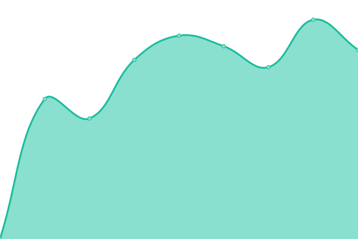 1093ms
     
 | 

<a href="https://demo.upptime.js.org/history/cerrajerosoviedo-com">100.00%</a>
    

|  [fontanerosoviedo.com](https://fontanerosoviedo.com) | 🟩 Up | [fontanerosoviedo-com.yml](https://github.com/pmo-2025/status-pmo/commits/HEAD/history/fontanerosoviedo-com.yml) | 

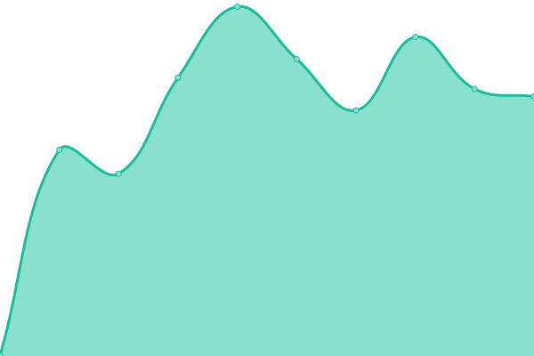 916ms
     
 | 

<a href="https://demo.upptime.js.org/history/fontanerosoviedo-com">100.00%</a>
    

|  [desatascosoviedo.com](https://desatascosoviedo.com) | 🟩 Up | [desatascosoviedo-com.yml](https://github.com/pmo-2025/status-pmo/commits/HEAD/history/desatascosoviedo-com.yml) | 

 1089ms
     
 | 

<a href="https://demo.upptime.js.org/history/desatascosoviedo-com">100.00%</a>
    

|  [electricistasoviedo.com](https://electricistasoviedo.com) | 🟩 Up | [electricistasoviedo-com.yml](https://github.com/pmo-2025/status-pmo/commits/HEAD/history/electricistasoviedo-com.yml) | 

 1048ms
     
 | 

<a href="https://demo.upptime.js.org/history/electricistasoviedo-com">100.00%</a>
    

|  [reparacionelectrodomesticosoviedo.com](https://reparacionelectrodomesticosoviedo.com) | 🟩 Up | [reparacionelectrodomesticosoviedo-com.yml](https://github.com/pmo-2025/status-pmo/commits/HEAD/history/reparacionelectrodomesticosoviedo-com.yml) | 

 1109ms
     
 | 

<a href="https://demo.upptime.js.org/history/reparacionelectrodomesticosoviedo-com">100.00%</a>
    

|  [cerrajerospamplona.com](https://cerrajerospamplona.com) | 🟩 Up | [cerrajerospamplona-com.yml](https://github.com/pmo-2025/status-pmo/commits/HEAD/history/cerrajerospamplona-com.yml) | 

 1021ms
     
 | 

<a href="https://demo.upptime.js.org/history/cerrajerospamplona-com">100.00%</a>
    

|  [cerrajeros-pamplona.com](https://cerrajeros-pamplona.com) | 🟩 Up | [cerrajeros-pamplona-com.yml](https://github.com/pmo-2025/status-pmo/commits/HEAD/history/cerrajeros-pamplona-com.yml) | 

 933ms
     
 | 

<a href="https://demo.upptime.js.org/history/cerrajeros-pamplona-com">100.00%</a>
    

|  [fontaneros-pamplona.es](https://fontaneros-pamplona.es) | 🟩 Up | [fontaneros-pamplona-es.yml](https://github.com/pmo-2025/status-pmo/commits/HEAD/history/fontaneros-pamplona-es.yml) | 

 1040ms
     
 | 

<a href="https://demo.upptime.js.org/history/fontaneros-pamplona-es">100.00%</a>
    

|  [electricistaspamplona.com](https://electricistaspamplona.com) | 🟩 Up | [electricistaspamplona-com.yml](https://github.com/pmo-2025/status-pmo/commits/HEAD/history/electricistaspamplona-com.yml) | 

 946ms
     
 | 

<a href="https://demo.upptime.js.org/history/electricistaspamplona-com">100.00%</a>
    

|  [pamplonareparacionelectrodomesticos.com](https://pamplonareparacionelectrodomesticos.com) | 🟩 Up | [pamplonareparacionelectrodomesticos-com.yml](https://github.com/pmo-2025/status-pmo/commits/HEAD/history/pamplonareparacionelectrodomesticos-com.yml) | 

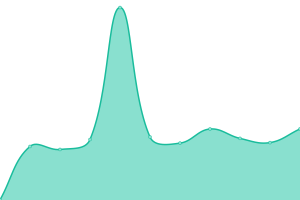 1146ms
     
 | 

<a href="https://demo.upptime.js.org/history/pamplonareparacionelectrodomesticos-com">100.00%</a>
    

|  [desatascospamplona.com](https://desatascospamplona.com) | 🟩 Up | [desatascospamplona-com.yml](https://github.com/pmo-2025/status-pmo/commits/HEAD/history/desatascospamplona-com.yml) | 

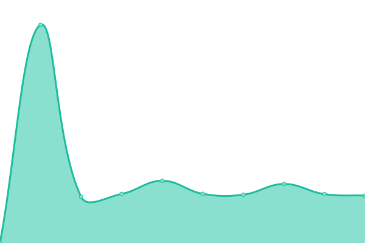 1189ms
     
 | 

<a href="https://demo.upptime.js.org/history/desatascospamplona-com">100.00%</a>
    

|  [cerrajerodemadrid.com](https://cerrajerodemadrid.com) | 🟩 Up | [cerrajerodemadrid-com.yml](https://github.com/pmo-2025/status-pmo/commits/HEAD/history/cerrajerodemadrid-com.yml) | 

 959ms
     
 | 

<a href="https://demo.upptime.js.org/history/cerrajerodemadrid-com">100.00%</a>
    

|  [fontanerodemadrid.com](https://fontanerodemadrid.com) | 🟩 Up | [fontanerodemadrid-com.yml](https://github.com/pmo-2025/status-pmo/commits/HEAD/history/fontanerodemadrid-com.yml) | 

 1042ms
     
 | 

<a href="https://demo.upptime.js.org/history/fontanerodemadrid-com">100.00%</a>
    

|  [electricistademadrid.com](https://electricistademadrid.com) | 🟩 Up | [electricistademadrid-com.yml](https://github.com/pmo-2025/status-pmo/commits/HEAD/history/electricistademadrid-com.yml) | 

 969ms
     
 | 

<a href="https://demo.upptime.js.org/history/electricistademadrid-com">100.00%</a>
    

|  [madrid-desatascos.com](https://madrid-desatascos.com) | 🟩 Up | [madrid-desatascos-com.yml](https://github.com/pmo-2025/status-pmo/commits/HEAD/history/madrid-desatascos-com.yml) | 

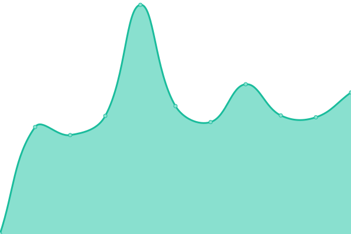 1258ms
     
 | 

<a href="https://demo.upptime.js.org/history/madrid-desatascos-com">100.00%</a>
    

|  [reparacionelectrodomesticosmadrid.com](https://reparacionelectrodomesticosmadrid.com) | 🟩 Up | [reparacionelectrodomesticosmadrid-com.yml](https://github.com/pmo-2025/status-pmo/commits/HEAD/history/reparacionelectrodomesticosmadrid-com.yml) | 

 932ms
     
 | 

<a href="https://demo.upptime.js.org/history/reparacionelectrodomesticosmadrid-com">100.00%</a>
    

|  [sevilladesatascos.com](https://sevilladesatascos.com) | 🟩 Up | [sevilladesatascos-com.yml](https://github.com/pmo-2025/status-pmo/commits/HEAD/history/sevilladesatascos-com.yml) | 

 934ms
     
 | 

<a href="https://demo.upptime.js.org/history/sevilladesatascos-com">100.00%</a>
    

|  [cerrajeros-en-sevilla.com](https://cerrajeros-en-sevilla.com) | 🟩 Up | [cerrajeros-en-sevilla-com.yml](https://github.com/pmo-2025/status-pmo/commits/HEAD/history/cerrajeros-en-sevilla-com.yml) | 

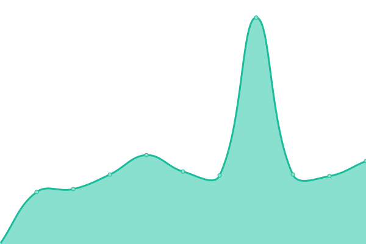 1042ms
     
 | 

<a href="https://demo.upptime.js.org/history/cerrajeros-en-sevilla-com">100.00%</a>
    

|  [fontaneros-sevilla.com](https://fontaneros-sevilla.com) | 🟩 Up | [fontaneros-sevilla-com.yml](https://github.com/pmo-2025/status-pmo/commits/HEAD/history/fontaneros-sevilla-com.yml) | 

 1027ms
     
 | 

<a href="https://demo.upptime.js.org/history/fontaneros-sevilla-com">100.00%</a>
    

|  [electricistas-sevilla.com](https://electricistas-sevilla.com) | 🟩 Up | [electricistas-sevilla-com.yml](https://github.com/pmo-2025/status-pmo/commits/HEAD/history/electricistas-sevilla-com.yml) | 

 1089ms
     
 | 

<a href="https://demo.upptime.js.org/history/electricistas-sevilla-com">100.00%</a>
    

|  [sevillareparacionelectrodomesticos.com](https://sevillareparacionelectrodomesticos.com) | 🟩 Up | [sevillareparacionelectrodomesticos-com.yml](https://github.com/pmo-2025/status-pmo/commits/HEAD/history/sevillareparacionelectrodomesticos-com.yml) | 

 923ms
     
 | 

<a href="https://demo.upptime.js.org/history/sevillareparacionelectrodomesticos-com">100.00%</a>
    

|  [laspalmas-desatascos.com](https://laspalmas-desatascos.com) | 🟩 Up | [laspalmas-desatascos-com.yml](https://github.com/pmo-2025/status-pmo/commits/HEAD/history/laspalmas-desatascos-com.yml) | 

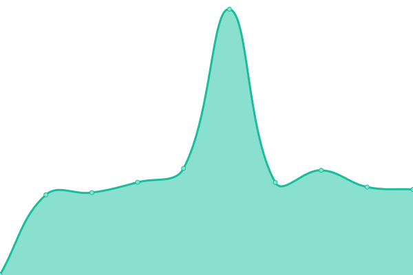 1072ms
     
 | 

<a href="https://demo.upptime.js.org/history/laspalmas-desatascos-com">100.00%</a>
    

|  [fontaneroslaspalmas.com](https://fontaneroslaspalmas.com) | 🟩 Up | [fontaneroslaspalmas-com.yml](https://github.com/pmo-2025/status-pmo/commits/HEAD/history/fontaneroslaspalmas-com.yml) | 

 911ms
     
 | 

<a href="https://demo.upptime.js.org/history/fontaneroslaspalmas-com">100.00%</a>
    

|  [electricistaslaspalmas.com](https://electricistaslaspalmas.com) | 🟩 Up | [electricistaslaspalmas-com.yml](https://github.com/pmo-2025/status-pmo/commits/HEAD/history/electricistaslaspalmas-com.yml) | 

 991ms
     
 | 

<a href="https://demo.upptime.js.org/history/electricistaslaspalmas-com">100.00%</a>
    

|  [cerrajeroslaspalmas.com](https://cerrajeroslaspalmas.com) | 🟩 Up | [cerrajeroslaspalmas-com.yml](https://github.com/pmo-2025/status-pmo/commits/HEAD/history/cerrajeroslaspalmas-com.yml) | 

 1033ms
     
 | 

<a href="https://demo.upptime.js.org/history/cerrajeroslaspalmas-com">100.00%</a>
    

|  [reparacionelectrodomesticoslaspalmas.com](https://reparacionelectrodomesticoslaspalmas.com) | 🟩 Up | [reparacionelectrodomesticoslaspalmas-com.yml](https://github.com/pmo-2025/status-pmo/commits/HEAD/history/reparacionelectrodomesticoslaspalmas-com.yml) | 

 1126ms
     
 | 

<a href="https://demo.upptime.js.org/history/reparacionelectrodomesticoslaspalmas-com">100.00%</a>
    

|  [fontanerosbilbao.com](https://fontanerosbilbao.com) | 🟩 Up | [fontanerosbilbao-com.yml](https://github.com/pmo-2025/status-pmo/commits/HEAD/history/fontanerosbilbao-com.yml) | 

 931ms
     
 | 

<a href="https://demo.upptime.js.org/history/fontanerosbilbao-com">100.00%</a>
    

|  [fontanerosvizcaya.com](https://fontanerosvizcaya.com) | 🟩 Up | [fontanerosvizcaya-com.yml](https://github.com/pmo-2025/status-pmo/commits/HEAD/history/fontanerosvizcaya-com.yml) | 

 971ms
     
 | 

<a href="https://demo.upptime.js.org/history/fontanerosvizcaya-com">100.00%</a>
    

|  [cerrajerosbilbao.com](https://cerrajerosbilbao.com) | 🟩 Up | [cerrajerosbilbao-com.yml](https://github.com/pmo-2025/status-pmo/commits/HEAD/history/cerrajerosbilbao-com.yml) | 

 1047ms
     
 | 

<a href="https://demo.upptime.js.org/history/cerrajerosbilbao-com">100.00%</a>
    

|  [electricistasbilbao.com](https://electricistasbilbao.com) | 🟩 Up | [electricistasbilbao-com.yml](https://github.com/pmo-2025/status-pmo/commits/HEAD/history/electricistasbilbao-com.yml) | 

 976ms
     
 | 

<a href="https://demo.upptime.js.org/history/electricistasbilbao-com">100.00%</a>
    

|  [electricistasvizcaya.com](https://electricistasvizcaya.com) | 🟩 Up | [electricistasvizcaya-com.yml](https://github.com/pmo-2025/status-pmo/commits/HEAD/history/electricistasvizcaya-com.yml) | 

 935ms
     
 | 

<a href="https://demo.upptime.js.org/history/electricistasvizcaya-com">100.00%</a>
    

|  [bilbaoreparacionelectrodomesticos.com](https://bilbaoreparacionelectrodomesticos.com) | 🟩 Up | [bilbaoreparacionelectrodomesticos-com.yml](https://github.com/pmo-2025/status-pmo/commits/HEAD/history/bilbaoreparacionelectrodomesticos-com.yml) | 

 992ms
     
 | 

<a href="https://demo.upptime.js.org/history/bilbaoreparacionelectrodomesticos-com">100.00%</a>
    

|  [barcelonacerrajeros.es](https://barcelonacerrajeros.es) | 🟩 Up | [barcelonacerrajeros-es.yml](https://github.com/pmo-2025/status-pmo/commits/HEAD/history/barcelonacerrajeros-es.yml) | 

 1026ms
     
 | 

<a href="https://demo.upptime.js.org/history/barcelonacerrajeros-es">100.00%</a>
    

|  [barcelonadesatascos.com](https://barcelonadesatascos.com) | 🟩 Up | [barcelonadesatascos-com.yml](https://github.com/pmo-2025/status-pmo/commits/HEAD/history/barcelonadesatascos-com.yml) | 

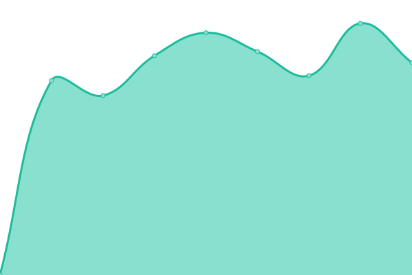 1167ms
     
 | 

<a href="https://demo.upptime.js.org/history/barcelonadesatascos-com">100.00%</a>
    

|  [fontanerosbarcelona.com](https://fontanerosbarcelona.com) | 🟩 Up | [fontanerosbarcelona-com.yml](https://github.com/pmo-2025/status-pmo/commits/HEAD/history/fontanerosbarcelona-com.yml) | 

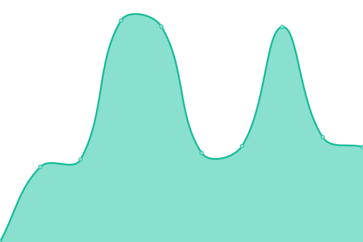 2494ms
     
 | 

<a href="https://demo.upptime.js.org/history/fontanerosbarcelona-com">100.00%</a>
    

|  [electricistasbarcelona.com](https://electricistasbarcelona.com) | 🟩 Up | [electricistasbarcelona-com.yml](https://github.com/pmo-2025/status-pmo/commits/HEAD/history/electricistasbarcelona-com.yml) | 

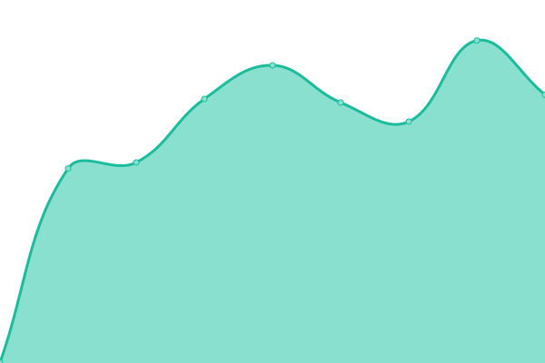 1038ms
     
 | 

<a href="https://demo.upptime.js.org/history/electricistasbarcelona-com">100.00%</a>
    

|  [reparacionelectrodomesticos-barcelona.com](https://reparacionelectrodomesticos-barcelona.com) | 🟩 Up | [reparacionelectrodomesticos-barcelona-com.yml](https://github.com/pmo-2025/status-pmo/commits/HEAD/history/reparacionelectrodomesticos-barcelona-com.yml) | 

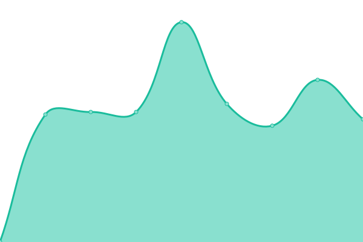 1343ms
     
 | 

<a href="https://demo.upptime.js.org/history/reparacionelectrodomesticos-barcelona-com">100.00%</a>
    

|  [tarragonacerrajeros.com](https://tarragonacerrajeros.com) | 🟩 Up | [tarragonacerrajeros-com.yml](https://github.com/pmo-2025/status-pmo/commits/HEAD/history/tarragonacerrajeros-com.yml) | 

 1002ms
     
 | 

<a href="https://demo.upptime.js.org/history/tarragonacerrajeros-com">100.00%</a>
    

|  [fontaneros-tarragona.com](https://fontaneros-tarragona.com) | 🟩 Up | [fontaneros-tarragona-com.yml](https://github.com/pmo-2025/status-pmo/commits/HEAD/history/fontaneros-tarragona-com.yml) | 

 1016ms
     
 | 

<a href="https://demo.upptime.js.org/history/fontaneros-tarragona-com">100.00%</a>
    

|  [electricistastarragona.com](https://electricistastarragona.com) | 🟩 Up | [electricistastarragona-com.yml](https://github.com/pmo-2025/status-pmo/commits/HEAD/history/electricistastarragona-com.yml) | 

 905ms
     
 | 

<a href="https://demo.upptime.js.org/history/electricistastarragona-com">100.00%</a>
    

|  [reparacionelectrodomesticostarragona.com](https://reparacionelectrodomesticostarragona.com) | 🟩 Up | [reparacionelectrodomesticostarragona-com.yml](https://github.com/pmo-2025/status-pmo/commits/HEAD/history/reparacionelectrodomesticostarragona-com.yml) | 

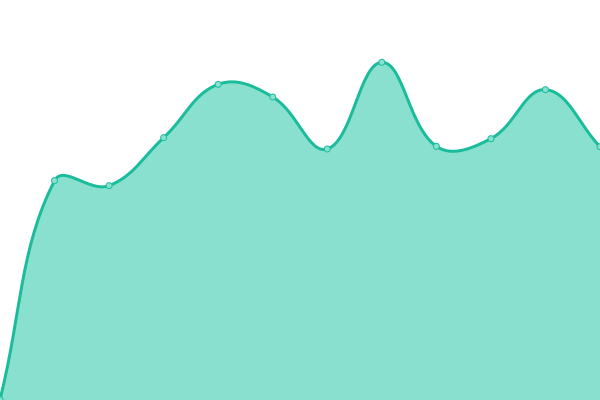 959ms
     
 | 

<a href="https://demo.upptime.js.org/history/reparacionelectrodomesticostarragona-com">100.00%</a>
    

|  [zaragozadesatascos.com](https://zaragozadesatascos.com) | 🟩 Up | [zaragozadesatascos-com.yml](https://github.com/pmo-2025/status-pmo/commits/HEAD/history/zaragozadesatascos-com.yml) | 

 1024ms
     
 | 

<a href="https://demo.upptime.js.org/history/zaragozadesatascos-com">100.00%</a>
    

|  [zaragozafontaneros.com](https://zaragozafontaneros.com) | 🟩 Up | [zaragozafontaneros-com.yml](https://github.com/pmo-2025/status-pmo/commits/HEAD/history/zaragozafontaneros-com.yml) | 

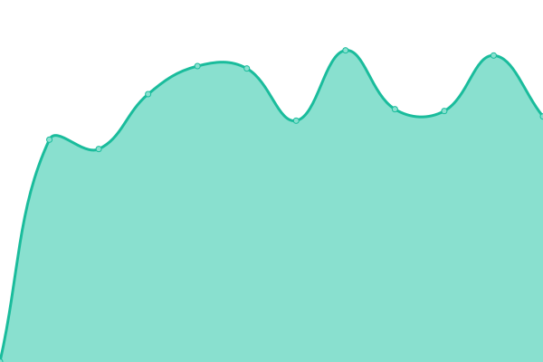 1009ms
     
 | 

<a href="https://demo.upptime.js.org/history/zaragozafontaneros-com">100.00%</a>
    

|  [zaragoza-fontaneros.com](https://zaragoza-fontaneros.com) | 🟩 Up | [zaragoza-fontaneros-com.yml](https://github.com/pmo-2025/status-pmo/commits/HEAD/history/zaragoza-fontaneros-com.yml) | 

 1015ms
     
 | 

<a href="https://demo.upptime.js.org/history/zaragoza-fontaneros-com">100.00%</a>
    

|  [zaragozacerrajeros.com](https://zaragozacerrajeros.com) | 🟩 Up | [zaragozacerrajeros-com.yml](https://github.com/pmo-2025/status-pmo/commits/HEAD/history/zaragozacerrajeros-com.yml) | 

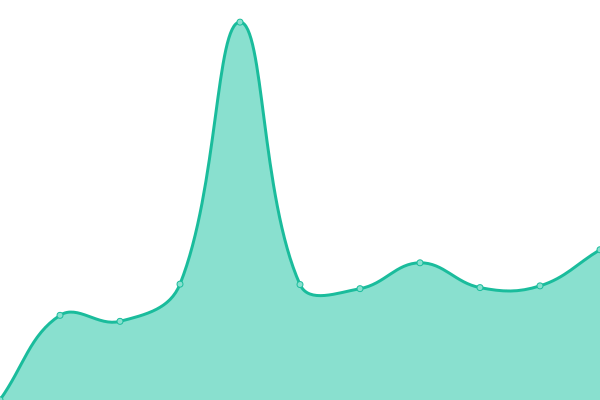 1028ms
     
 | 

<a href="https://demo.upptime.js.org/history/zaragozacerrajeros-com">100.00%</a>
    

|  [cerrajerosenzaragoza24.com](https://cerrajerosenzaragoza24.com) | 🟩 Up | [cerrajerosenzaragoza24-com.yml](https://github.com/pmo-2025/status-pmo/commits/HEAD/history/cerrajerosenzaragoza24-com.yml) | 

 902ms
     
 | 

<a href="https://demo.upptime.js.org/history/cerrajerosenzaragoza24-com">100.00%</a>
    

|  [zaragozaelectricistas.com](https://zaragozaelectricistas.com) | 🟩 Up | [zaragozaelectricistas-com.yml](https://github.com/pmo-2025/status-pmo/commits/HEAD/history/zaragozaelectricistas-com.yml) | 

 944ms
     
 | 

<a href="https://demo.upptime.js.org/history/zaragozaelectricistas-com">100.00%</a>
    

|  [electricistas-zaragoza.com](https://electricistas-zaragoza.com) | 🟩 Up | [electricistas-zaragoza-com.yml](https://github.com/pmo-2025/status-pmo/commits/HEAD/history/electricistas-zaragoza-com.yml) | 

 907ms
     
 | 

<a href="https://demo.upptime.js.org/history/electricistas-zaragoza-com">100.00%</a>
    

|  [reparacionelectrodomesticos-zaragoza.com](https://reparacionelectrodomesticos-zaragoza.com) | 🟩 Up | [reparacionelectrodomesticos-zaragoza-com.yml](https://github.com/pmo-2025/status-pmo/commits/HEAD/history/reparacionelectrodomesticos-zaragoza-com.yml) | 

 916ms
     
 | 

<a href="https://demo.upptime.js.org/history/reparacionelectrodomesticos-zaragoza-com">100.00%</a>
    

|  [cerrajeros-castellon.com](https://cerrajeros-castellon.com) | 🟩 Up | [cerrajeros-castellon-com.yml](https://github.com/pmo-2025/status-pmo/commits/HEAD/history/cerrajeros-castellon-com.yml) | 

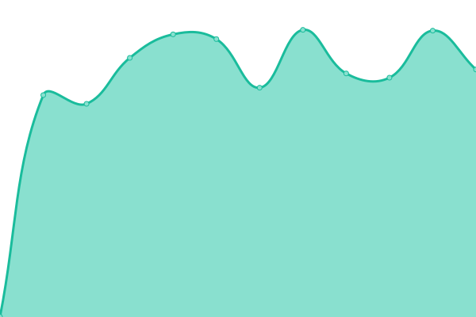 1092ms
     
 | 

<a href="https://demo.upptime.js.org/history/cerrajeros-castellon-com">100.00%</a>
    

|  [desatascos-castellon.com](https://desatascos-castellon.com) | 🟩 Up | [desatascos-castellon-com.yml](https://github.com/pmo-2025/status-pmo/commits/HEAD/history/desatascos-castellon-com.yml) | 

 999ms
     
 | 

<a href="https://demo.upptime.js.org/history/desatascos-castellon-com">100.00%</a>
    

|  [electricistas-castellon.com](https://electricistas-castellon.com) | 🟩 Up | [electricistas-castellon-com.yml](https://github.com/pmo-2025/status-pmo/commits/HEAD/history/electricistas-castellon-com.yml) | 

 1100ms
     
 | 

<a href="https://demo.upptime.js.org/history/electricistas-castellon-com">100.00%</a>
    

|  [fontaneros-castellon.com](https://fontaneros-castellon.com) | 🟩 Up | [fontaneros-castellon-com.yml](https://github.com/pmo-2025/status-pmo/commits/HEAD/history/fontaneros-castellon-com.yml) | 

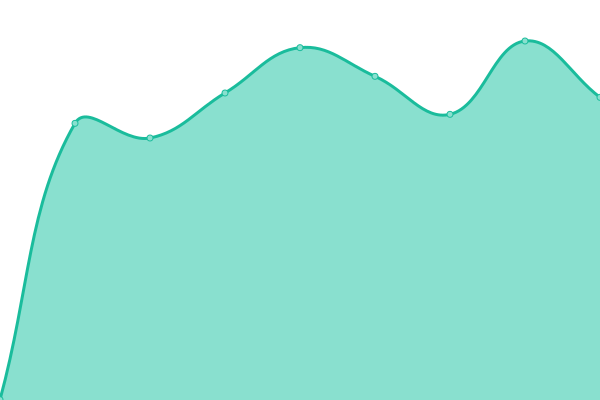 1088ms
     
 | 

<a href="https://demo.upptime.js.org/history/fontaneros-castellon-com">100.00%</a>
    

|  [reparacionelectrodomesticos-castellon.com](https://reparacionelectrodomesticos-castellon.com) | 🟩 Up | [reparacionelectrodomesticos-castellon-com.yml](https://github.com/pmo-2025/status-pmo/commits/HEAD/history/reparacionelectrodomesticos-castellon-com.yml) | 

 1097ms
     
 | 

<a href="https://demo.upptime.js.org/history/reparacionelectrodomesticos-castellon-com">100.00%</a>
    

|  [reparacionelectrodomesticosguadalajara.com](https://reparacionelectrodomesticosguadalajara.com) | 🟩 Up | [reparacionelectrodomesticosguadalajara-com.yml](https://github.com/pmo-2025/status-pmo/commits/HEAD/history/reparacionelectrodomesticosguadalajara-com.yml) | 

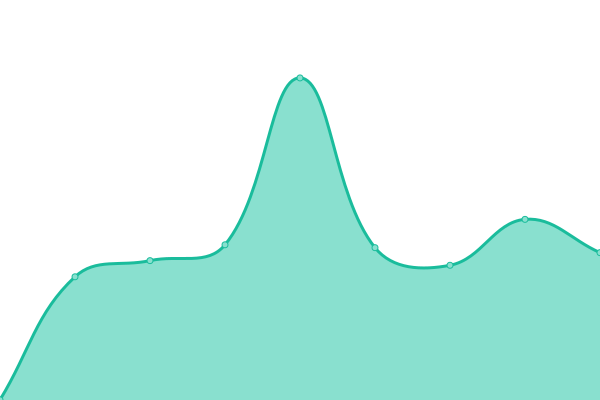 1147ms
     
 | 

<a href="https://demo.upptime.js.org/history/reparacionelectrodomesticosguadalajara-com">100.00%</a>
    

|  [cerrajeros-guadalajara.com](https://cerrajeros-guadalajara.com) | 🟩 Up | [cerrajeros-guadalajara-com.yml](https://github.com/pmo-2025/status-pmo/commits/HEAD/history/cerrajeros-guadalajara-com.yml) | 

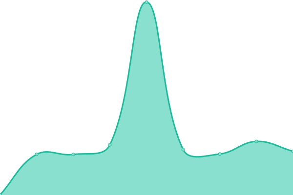 993ms
     
 | 

<a href="https://demo.upptime.js.org/history/cerrajeros-guadalajara-com">100.00%</a>
    

|  [electricistas-guadalajara.com](https://electricistas-guadalajara.com) | 🟩 Up | [electricistas-guadalajara-com.yml](https://github.com/pmo-2025/status-pmo/commits/HEAD/history/electricistas-guadalajara-com.yml) | 

 990ms
     
 | 

<a href="https://demo.upptime.js.org/history/electricistas-guadalajara-com">100.00%</a>
    

|  [fontaneros-guadalajara.com](https://fontaneros-guadalajara.com) | 🟩 Up | [fontaneros-guadalajara-com.yml](https://github.com/pmo-2025/status-pmo/commits/HEAD/history/fontaneros-guadalajara-com.yml) | 

 1085ms
     
 | 

<a href="https://demo.upptime.js.org/history/fontaneros-guadalajara-com">100.00%</a>
    

|  [desatascos-guadalajara.com](https://desatascos-guadalajara.com) | 🟩 Up | [desatascos-guadalajara-com.yml](https://github.com/pmo-2025/status-pmo/commits/HEAD/history/desatascos-guadalajara-com.yml) | 

 1099ms
     
 | 

<a href="https://demo.upptime.js.org/history/desatascos-guadalajara-com">100.00%</a>
    

|  [desatascos-vitoria.com](https://desatascos-vitoria.com) | 🟩 Up | [desatascos-vitoria-com.yml](https://github.com/pmo-2025/status-pmo/commits/HEAD/history/desatascos-vitoria-com.yml) | 

 906ms
     
 | 

<a href="https://demo.upptime.js.org/history/desatascos-vitoria-com">100.00%</a>
    

|  [cerrajeros-vitoria.com](https://cerrajeros-vitoria.com) | 🟩 Up | [cerrajeros-vitoria-com.yml](https://github.com/pmo-2025/status-pmo/commits/HEAD/history/cerrajeros-vitoria-com.yml) | 

 992ms
     
 | 

<a href="https://demo.upptime.js.org/history/cerrajeros-vitoria-com">100.00%</a>
    

|  [fontaneros-vitoria.com](https://fontaneros-vitoria.com) | 🟩 Up | [fontaneros-vitoria-com.yml](https://github.com/pmo-2025/status-pmo/commits/HEAD/history/fontaneros-vitoria-com.yml) | 

 960ms
     
 | 

<a href="https://demo.upptime.js.org/history/fontaneros-vitoria-com">100.00%</a>
    

|  [reparacionelectrodomesticosvitoria.com](https://reparacionelectrodomesticosvitoria.com) | 🟩 Up | [reparacionelectrodomesticosvitoria-com.yml](https://github.com/pmo-2025/status-pmo/commits/HEAD/history/reparacionelectrodomesticosvitoria-com.yml) | 

 913ms
     
 | 

<a href="https://demo.upptime.js.org/history/reparacionelectrodomesticosvitoria-com">100.00%</a>
    

|  [electricistas-vitoria.com](https://electricistas-vitoria.com) | 🟩 Up | [electricistas-vitoria-com.yml](https://github.com/pmo-2025/status-pmo/commits/HEAD/history/electricistas-vitoria-com.yml) | 

 1036ms
     
 | 

<a href="https://demo.upptime.js.org/history/electricistas-vitoria-com">100.00%</a>
    

|  [electricistas.page](https://electricistas.page) | 🟩 Up | [electricistas-page.yml](https://github.com/pmo-2025/status-pmo/commits/HEAD/history/electricistas-page.yml) | 

 1341ms
     
 | 

<a href="https://demo.upptime.js.org/history/electricistas-page">100.00%</a>
    

|  [cerrajerosbarcelona.page](https://cerrajerosbarcelona.page) | 🟩 Up | [cerrajerosbarcelona-page.yml](https://github.com/pmo-2025/status-pmo/commits/HEAD/history/cerrajerosbarcelona-page.yml) | 

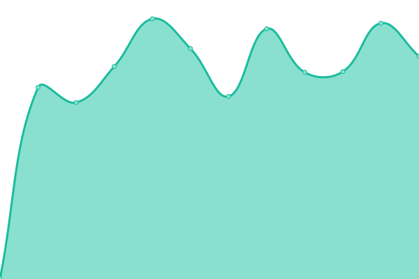 1111ms
     
 | 

<a href="https://demo.upptime.js.org/history/cerrajerosbarcelona-page">100.00%</a>
    

|  [fontanerosbarcelona.page](https://fontanerosbarcelona.page) | 🟩 Up | [fontanerosbarcelona-page.yml](https://github.com/pmo-2025/status-pmo/commits/HEAD/history/fontanerosbarcelona-page.yml) | 

 1144ms
     
 | 

<a href="https://demo.upptime.js.org/history/fontanerosbarcelona-page">100.00%</a>
    

|  [cerrajeroscastellon.com](https://cerrajeroscastellon.com) | 🟩 Up | [cerrajeroscastellon-com.yml](https://github.com/pmo-2025/status-pmo/commits/HEAD/history/cerrajeroscastellon-com.yml) | 

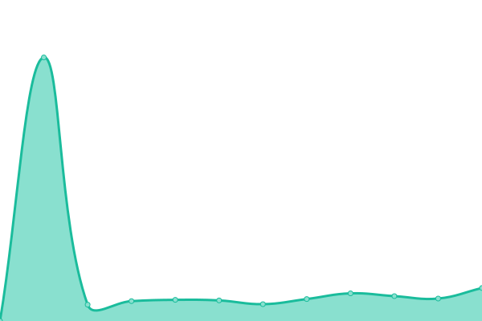 1725ms
     
 | 

<a href="https://demo.upptime.js.org/history/cerrajeroscastellon-com">100.00%</a>
    

|  [fontaneroscastellon.com](https://fontaneroscastellon.com) | 🟩 Up | [fontaneroscastellon-com.yml](https://github.com/pmo-2025/status-pmo/commits/HEAD/history/fontaneroscastellon-com.yml) | 

 1088ms
     
 | 

<a href="https://demo.upptime.js.org/history/fontaneroscastellon-com">100.00%</a>
    

|  [cerrajerosbilbao.top](https://cerrajerosbilbao.top) | 🟩 Up | [cerrajerosbilbao-top.yml](https://github.com/pmo-2025/status-pmo/commits/HEAD/history/cerrajerosbilbao-top.yml) | 

 1062ms
     
 | 

<a href="https://demo.upptime.js.org/history/cerrajerosbilbao-top">100.00%</a>
    

|  [fontanerosbilbao.net](https://fontanerosbilbao.net) | 🟩 Up | [fontanerosbilbao-net.yml](https://github.com/pmo-2025/status-pmo/commits/HEAD/history/fontanerosbilbao-net.yml) | 

 1076ms
     
 | 

<a href="https://demo.upptime.js.org/history/fontanerosbilbao-net">100.00%</a>
    

|  [cerrajerosmallorca.top](https://cerrajerosmallorca.top) | 🟩 Up | [cerrajerosmallorca-top.yml](https://github.com/pmo-2025/status-pmo/commits/HEAD/history/cerrajerosmallorca-top.yml) | 

 2166ms
     
 | 

<a href="https://demo.upptime.js.org/history/cerrajerosmallorca-top">100.00%</a>
    

|  [fontanerosmallorca.net](https://fontanerosmallorca.net) | 🟩 Up | [fontanerosmallorca-net.yml](https://github.com/pmo-2025/status-pmo/commits/HEAD/history/fontanerosmallorca-net.yml) | 

 1076ms
     
 | 

<a href="https://demo.upptime.js.org/history/fontanerosmallorca-net">100.00%</a>
    

|  [cerrajerosmadrid.page](https://cerrajerosmadrid.page) | 🟩 Up | [cerrajerosmadrid-page.yml](https://github.com/pmo-2025/status-pmo/commits/HEAD/history/cerrajerosmadrid-page.yml) | 

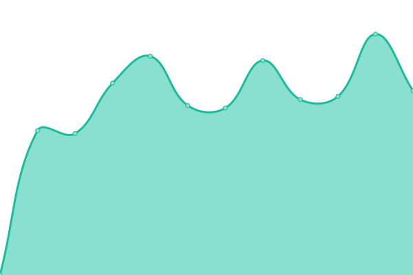 1089ms
     
 | 

<a href="https://demo.upptime.js.org/history/cerrajerosmadrid-page">100.00%</a>
    

|  [fontanerosmadrid.page](https://fontanerosmadrid.page) | 🟩 Up | [fontanerosmadrid-page.yml](https://github.com/pmo-2025/status-pmo/commits/HEAD/history/fontanerosmadrid-page.yml) | 

 1124ms
     
 | 

<a href="https://demo.upptime.js.org/history/fontanerosmadrid-page">100.00%</a>
    

|  [fontanerosvalencia.page](https://fontanerosvalencia.page) | 🟩 Up | [fontanerosvalencia-page.yml](https://github.com/pmo-2025/status-pmo/commits/HEAD/history/fontanerosvalencia-page.yml) | 

 1097ms
     
 | 

<a href="https://demo.upptime.js.org/history/fontanerosvalencia-page">100.00%</a>
    

|  [enreparaciones.com](https://enreparaciones.com) | 🟩 Up | [enreparaciones-com.yml](https://github.com/pmo-2025/status-pmo/commits/HEAD/history/enreparaciones-com.yml) | 

 906ms
     
 | 

<a href="https://demo.upptime.js.org/history/enreparaciones-com">100.00%</a>
    

|  [reparacionesya.org](https://reparacionesya.org) | 🟩 Up | [reparacionesya-org.yml](https://github.com/pmo-2025/status-pmo/commits/HEAD/history/reparacionesya-org.yml) | 

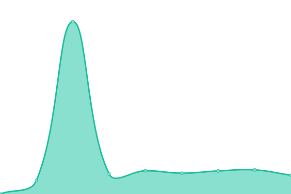 1486ms
     
 | 

<a href="https://demo.upptime.js.org/history/reparacionesya-org">100.00%</a>
    

|  [dinoscuando.com](https://dinoscuando.com) | 🟩 Up | [dinoscuando-com.yml](https://github.com/pmo-2025/status-pmo/commits/HEAD/history/dinoscuando-com.yml) | 

 838ms
     
 | 

<a href="https://demo.upptime.js.org/history/dinoscuando-com">100.00%</a>
    

|  [arregla2.com](https://arregla2.com) | 🟩 Up | [arregla2-com.yml](https://github.com/pmo-2025/status-pmo/commits/HEAD/history/arregla2-com.yml) | 

 1118ms
     
 | 

<a href="https://demo.upptime.js.org/history/arregla2-com">100.00%</a>
    

|  [como-reparo.com](https://como-reparo.com) | 🟩 Up | [como-reparo-com.yml](https://github.com/pmo-2025/status-pmo/commits/HEAD/history/como-reparo-com.yml) | 

 2469ms
     
 | 

<a href="https://demo.upptime.js.org/history/como-reparo-com">100.00%</a>
    

|  [todoviajar.net](https://todoviajar.net) | 🟥 Down | [todoviajar-net.yml](https://github.com/pmo-2025/status-pmo/commits/HEAD/history/todoviajar-net.yml) | 

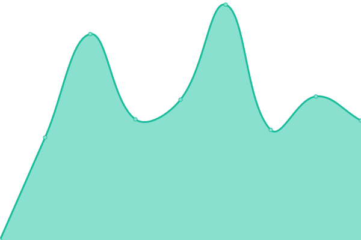 0ms
     
 | 

<a href="https://demo.upptime.js.org/history/todoviajar-net">0.00%</a>
    

|  [contabilidad10.com](https://contabilidad10.com) | 🟥 Down | [contabilidad10-com.yml](https://github.com/pmo-2025/status-pmo/commits/HEAD/history/contabilidad10-com.yml) | 

 0ms
     
 | 

<a href="https://demo.upptime.js.org/history/contabilidad10-com">0.00%</a>
    

|  [customgraf.es](https://customgraf.es) | 🟩 Up | [customgraf-es.yml](https://github.com/pmo-2025/status-pmo/commits/HEAD/history/customgraf-es.yml) | 

 1253ms
     
 | 

<a href="https://demo.upptime.js.org/history/customgraf-es">100.00%</a>
    

|  [abriryrecuperar.com](https://abriryrecuperar.com) | 🟩 Up | [abriryrecuperar-com.yml](https://github.com/pmo-2025/status-pmo/commits/HEAD/history/abriryrecuperar-com.yml) | 

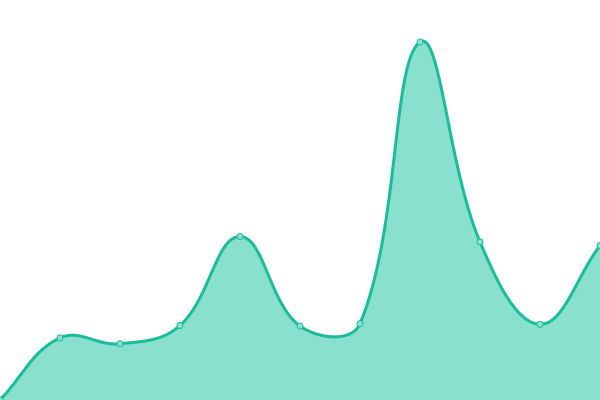 2586ms
     
 | 

<a href="https://demo.upptime.js.org/history/abriryrecuperar-com">100.00%</a>
    

|  [paramoto.es](https://paramoto.es) | 🟥 Down | [paramoto-es.yml](https://github.com/pmo-2025/status-pmo/commits/HEAD/history/paramoto-es.yml) | 

 0ms
     
 | 

<a href="https://demo.upptime.js.org/history/paramoto-es">0.00%</a>
    

|  [mezclaquetemezcla.com](https://mezclaquetemezcla.com) | 🟩 Up | [mezclaquetemezcla-com.yml](https://github.com/pmo-2025/status-pmo/commits/HEAD/history/mezclaquetemezcla-com.yml) | 

 2252ms
     
 | 

<a href="https://demo.upptime.js.org/history/mezclaquetemezcla-com">100.00%</a>
    

|  [todo-pesca.com](https://todo-pesca.com) | 🟩 Up | [todo-pesca-com.yml](https://github.com/pmo-2025/status-pmo/commits/HEAD/history/todo-pesca-com.yml) | 

 1146ms
     
 | 

<a href="https://demo.upptime.js.org/history/todo-pesca-com">100.00%</a>
    

|  [hydrologicgroup.es](https://hydrologicgroup.es) | 🟩 Up | [hydrologicgroup-es.yml](https://github.com/pmo-2025/status-pmo/commits/HEAD/history/hydrologicgroup-es.yml) | 

 4213ms
     
 | 

<a href="https://demo.upptime.js.org/history/hydrologicgroup-es">100.00%</a>
    

|  [telas-mexico.mx](https://telas-mexico.mx) | 🟩 Up | [telas-mexico-mx.yml](https://github.com/pmo-2025/status-pmo/commits/HEAD/history/telas-mexico-mx.yml) | 

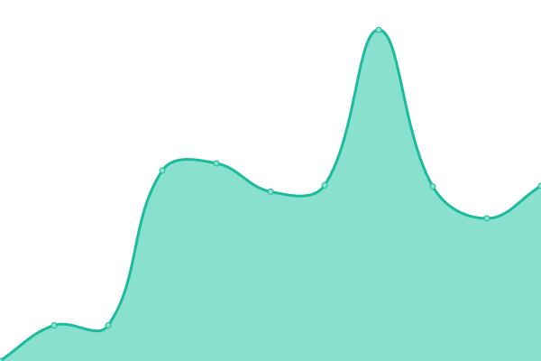 2010ms
     
 | 

<a href="https://demo.upptime.js.org/history/telas-mexico-mx">100.00%</a>
    

|  [genealogico.es](https://genealogico.es) | 🟩 Up | [genealogico-es.yml](https://github.com/pmo-2025/status-pmo/commits/HEAD/history/genealogico-es.yml) | 

 1134ms
     
 | 

<a href="https://demo.upptime.js.org/history/genealogico-es">100.00%</a>
    

|  [sondeled.es](https://sondeled.es) | 🟩 Up | [sondeled-es.yml](https://github.com/pmo-2025/status-pmo/commits/HEAD/history/sondeled-es.yml) | 

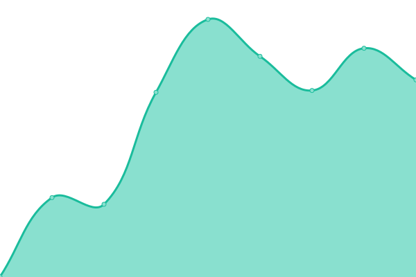 1018ms
     
 | 

<a href="https://demo.upptime.js.org/history/sondeled-es">100.00%</a>
    

|  [tubelleza.es](https://tubelleza.es) | 🟩 Up | [tubelleza-es.yml](https://github.com/pmo-2025/status-pmo/commits/HEAD/history/tubelleza-es.yml) | 

 996ms
     
 | 

<a href="https://demo.upptime.js.org/history/tubelleza-es">100.00%</a>
    

|  [piemaproteccion.es](https://piemaproteccion.es) | 🟩 Up | [piemaproteccion-es.yml](https://github.com/pmo-2025/status-pmo/commits/HEAD/history/piemaproteccion-es.yml) | 

 973ms
     
 | 

<a href="https://demo.upptime.js.org/history/piemaproteccion-es">100.00%</a>
    

|  [comando-app.com](https://comando-app.com) | 🟩 Up | [comando-app-com.yml](https://github.com/pmo-2025/status-pmo/commits/HEAD/history/comando-app-com.yml) | 

 3216ms
     
 | 

<a href="https://demo.upptime.js.org/history/comando-app-com">100.00%</a>
    

|  [avicolamauro2020.it](https://avicolamauro2020.it) | 🟩 Up | [avicolamauro2020-it.yml](https://github.com/pmo-2025/status-pmo/commits/HEAD/history/avicolamauro2020-it.yml) | 

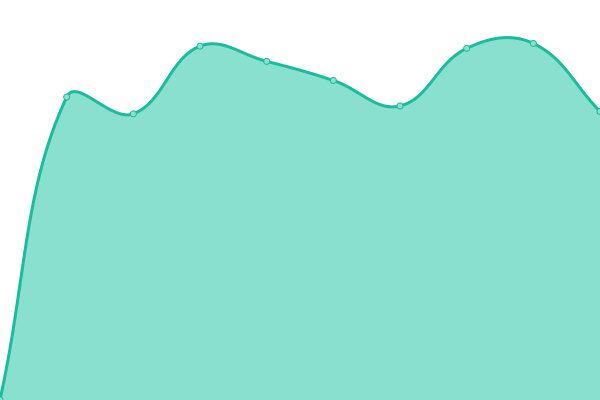 2930ms
     
 | 

<a href="https://demo.upptime.js.org/history/avicolamauro2020-it">100.00%</a>
    

|  [pmasters.es](http://pmasters.es) | 🟩 Up | [pmasters-es.yml](https://github.com/pmo-2025/status-pmo/commits/HEAD/history/pmasters-es.yml) | 

 2120ms
     
 | 

<a href="https://demo.upptime.js.org/history/pmasters-es">57.63%</a>
    

|  [teoremas.net](https://teoremas.net) | 🟩 Up | [teoremas-net.yml](https://github.com/pmo-2025/status-pmo/commits/HEAD/history/teoremas-net.yml) | 

 1930ms
     
 | 

<a href="https://demo.upptime.js.org/history/teoremas-net">100.00%</a>
    

|  [fiestasde.es](https://fiestasde.es) | 🟩 Up | [fiestasde-es.yml](https://github.com/pmo-2025/status-pmo/commits/HEAD/history/fiestasde-es.yml) | 

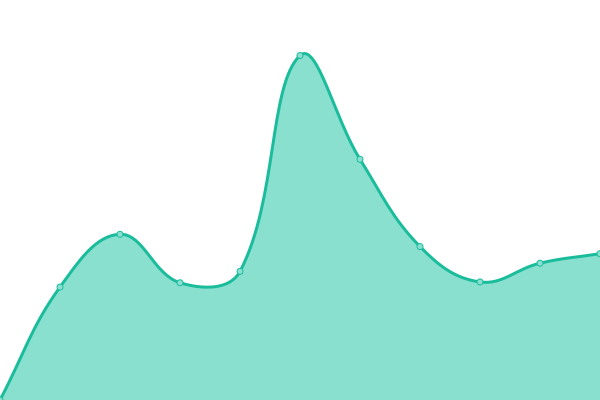 2576ms
     
 | 

<a href="https://demo.upptime.js.org/history/fiestasde-es">100.00%</a>
    

|  [degomaeva.com](https://degomaeva.com) | 🟩 Up | [degomaeva-com.yml](https://github.com/pmo-2025/status-pmo/commits/HEAD/history/degomaeva-com.yml) | 

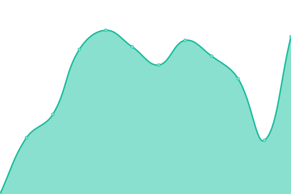 2501ms
     
 | 

<a href="https://demo.upptime.js.org/history/degomaeva-com">100.00%</a>
    

|  [opositan.com](https://opositan.com) | 🟩 Up | [opositan-com.yml](https://github.com/pmo-2025/status-pmo/commits/HEAD/history/opositan-com.yml) | 

 1914ms
     
 | 

<a href="https://demo.upptime.js.org/history/opositan-com">100.00%</a>
    

|  [organigrama10.com](https://organigrama10.com) | 🟩 Up | [organigrama10-com.yml](https://github.com/pmo-2025/status-pmo/commits/HEAD/history/organigrama10-com.yml) | 

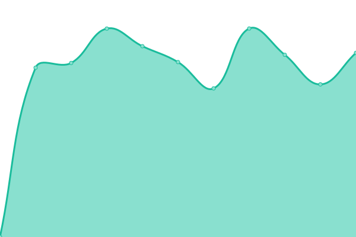 2433ms
     
 | 

<a href="https://demo.upptime.js.org/history/organigrama10-com">100.00%</a>
    

|  [montar10.com](https://montar10.com) | 🟩 Up | [montar10-com.yml](https://github.com/pmo-2025/status-pmo/commits/HEAD/history/montar10-com.yml) | 

 2199ms
     
 | 

<a href="https://demo.upptime.js.org/history/montar10-com">100.00%</a>
    

|  [mundo-sims.com](https://mundo-sims.com) | 🟩 Up | [mundo-sims-com.yml](https://github.com/pmo-2025/status-pmo/commits/HEAD/history/mundo-sims-com.yml) | 

 1220ms
     
 | 

<a href="https://demo.upptime.js.org/history/mundo-sims-com">100.00%</a>
    

|  [moto-noticias.com](https://moto-noticias.com) | 🟩 Up | [moto-noticias-com.yml](https://github.com/pmo-2025/status-pmo/commits/HEAD/history/moto-noticias-com.yml) | 

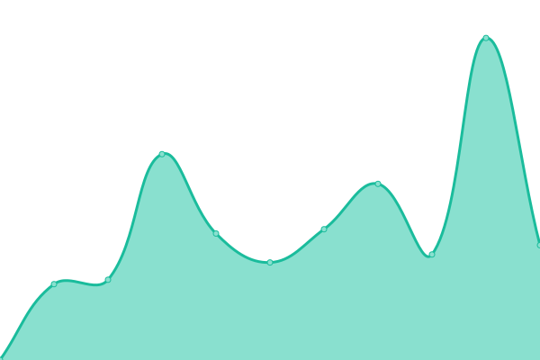 2303ms
     
 | 

<a href="https://demo.upptime.js.org/history/moto-noticias-com">100.00%</a>
    

|  [almorzar.es](https://almorzar.es) | 🟥 Down | [almorzar-es.yml](https://github.com/pmo-2025/status-pmo/commits/HEAD/history/almorzar-es.yml) | 

 2922ms
     
 | 

<a href="https://demo.upptime.js.org/history/almorzar-es">78.96%</a>
    

|  [ecoparque.es](https://ecoparque.es) | 🟩 Up | [ecoparque-es.yml](https://github.com/pmo-2025/status-pmo/commits/HEAD/history/ecoparque-es.yml) | 

 2259ms
     
 | 

<a href="https://demo.upptime.js.org/history/ecoparque-es">100.00%</a>
    

|  [turispanish.com](https://turispanish.com) | 🟩 Up | [turispanish-com.yml](https://github.com/pmo-2025/status-pmo/commits/HEAD/history/turispanish-com.yml) | 

 1896ms
     
 | 

<a href="https://demo.upptime.js.org/history/turispanish-com">100.00%</a>
    

|  [becas10.com](https://becas10.com) | 🟥 Down | [becas10-com.yml](https://github.com/pmo-2025/status-pmo/commits/HEAD/history/becas10-com.yml) | 

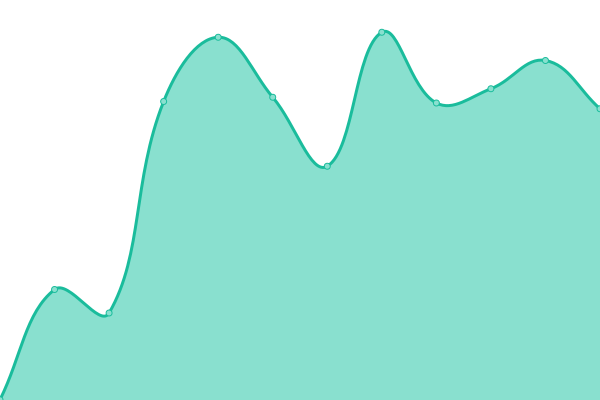 1211ms
     
 | 

<a href="https://demo.upptime.js.org/history/becas10-com">6.78%</a>
    

|  [autonomos10.com](https://autonomos10.com) | 🟩 Up | [autonomos10-com.yml](https://github.com/pmo-2025/status-pmo/commits/HEAD/history/autonomos10-com.yml) | 

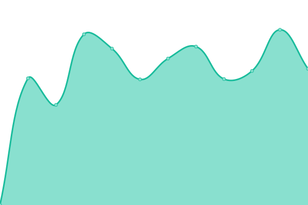 4584ms
     
 | 

<a href="https://demo.upptime.js.org/history/autonomos10-com">100.00%</a>
    

|  [robotica10.com](https://robotica10.com) | 🟩 Up | [robotica10-com.yml](https://github.com/pmo-2025/status-pmo/commits/HEAD/history/robotica10-com.yml) | 

 2035ms
     
 | 

<a href="https://demo.upptime.js.org/history/robotica10-com">100.00%</a>
    

|  [valenciaestrella.com](https://valenciaestrella.com) | 🟩 Up | [valenciaestrella-com.yml](https://github.com/pmo-2025/status-pmo/commits/HEAD/history/valenciaestrella-com.yml) | 

 4596ms
     
 | 

<a href="https://demo.upptime.js.org/history/valenciaestrella-com">100.00%</a>
    

|  [tiendanavajas.es](https://tiendanavajas.es) | 🟩 Up | [tiendanavajas-es.yml](https://github.com/pmo-2025/status-pmo/commits/HEAD/history/tiendanavajas-es.yml) | 

 2333ms
     
 | 

<a href="https://demo.upptime.js.org/history/tiendanavajas-es">100.00%</a>
    

|  [acerrajeros.com](https://acerrajeros.com) | 🟩 Up | [acerrajeros-com.yml](https://github.com/pmo-2025/status-pmo/commits/HEAD/history/acerrajeros-com.yml) | 

 3692ms
     
 | 

<a href="https://demo.upptime.js.org/history/acerrajeros-com">100.00%</a>
    

|  [agrupacioncerrajera.es](https://agrupacioncerrajera.es) | 🟩 Up | [agrupacioncerrajera-es.yml](https://github.com/pmo-2025/status-pmo/commits/HEAD/history/agrupacioncerrajera-es.yml) | 

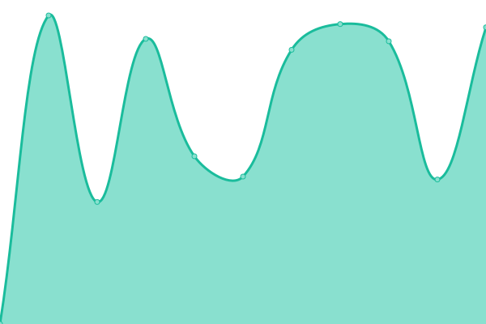 1166ms
     
 | 

<a href="https://demo.upptime.js.org/history/agrupacioncerrajera-es">100.00%</a>
    

|  [autonomos24h.es](https://autonomos24h.es) | 🟩 Up | [autonomos24h-es.yml](https://github.com/pmo-2025/status-pmo/commits/HEAD/history/autonomos24h-es.yml) | 

 1130ms
     
 | 

<a href="https://demo.upptime.js.org/history/autonomos24h-es">100.00%</a>
    

|  [cerrajeriadevalencia.com](https://cerrajeriadevalencia.com) | 🟩 Up | [cerrajeriadevalencia-com.yml](https://github.com/pmo-2025/status-pmo/commits/HEAD/history/cerrajeriadevalencia-com.yml) | 

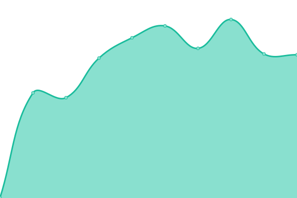 1051ms
     
 | 

<a href="https://demo.upptime.js.org/history/cerrajeriadevalencia-com">100.00%</a>
    

|  [cerrajeriavalencia.es](https://cerrajeriavalencia.es) | 🟩 Up | [cerrajeriavalencia-es.yml](https://github.com/pmo-2025/status-pmo/commits/HEAD/history/cerrajeriavalencia-es.yml) | 

 4003ms
     
 | 

<a href="https://demo.upptime.js.org/history/cerrajeriavalencia-es">100.00%</a>
    

|  [cerrajeroalaquas.com](https://cerrajeroalaquas.com) | 🟩 Up | [cerrajeroalaquas-com.yml](https://github.com/pmo-2025/status-pmo/commits/HEAD/history/cerrajeroalaquas-com.yml) | 

 1033ms
     
 | 

<a href="https://demo.upptime.js.org/history/cerrajeroalaquas-com">100.00%</a>
    

|  [cerrajeroalaquas.es](https://cerrajeroalaquas.es) | 🟩 Up | [cerrajeroalaquas-es.yml](https://github.com/pmo-2025/status-pmo/commits/HEAD/history/cerrajeroalaquas-es.yml) | 

 2170ms
     
 | 

<a href="https://demo.upptime.js.org/history/cerrajeroalaquas-es">100.00%</a>
    

|  [cerrajeroalbal.es](https://cerrajeroalbal.es) | 🟩 Up | [cerrajeroalbal-es.yml](https://github.com/pmo-2025/status-pmo/commits/HEAD/history/cerrajeroalbal-es.yml) | 

 2077ms
     
 | 

<a href="https://demo.upptime.js.org/history/cerrajeroalbal-es">100.00%</a>
    

|  [cerrajeroalboraya.com](https://cerrajeroalboraya.com) | 🟩 Up | [cerrajeroalboraya-com.yml](https://github.com/pmo-2025/status-pmo/commits/HEAD/history/cerrajeroalboraya-com.yml) | 

 2095ms
     
 | 

<a href="https://demo.upptime.js.org/history/cerrajeroalboraya-com">100.00%</a>
    

|  [cerrajeroalboraya.es](https://cerrajeroalboraya.es) | 🟩 Up | [cerrajeroalboraya-es.yml](https://github.com/pmo-2025/status-pmo/commits/HEAD/history/cerrajeroalboraya-es.yml) | 

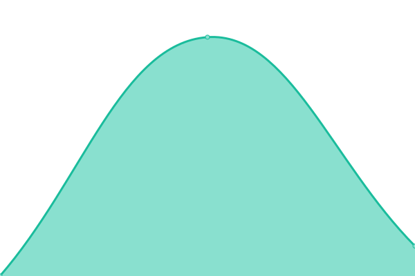 1834ms
     
 | 

<a href="https://demo.upptime.js.org/history/cerrajeroalboraya-es">100.00%</a>
    

|  [cerrajeroaldaia.es](https://cerrajeroaldaia.es) | 🟩 Up | [cerrajeroaldaia-es.yml](https://github.com/pmo-2025/status-pmo/commits/HEAD/history/cerrajeroaldaia-es.yml) | 

 1982ms
     
 | 

<a href="https://demo.upptime.js.org/history/cerrajeroaldaia-es">100.00%</a>
    

|  [cerrajeroalfafar.com](https://cerrajeroalfafar.com) | 🟩 Up | [cerrajeroalfafar-com.yml](https://github.com/pmo-2025/status-pmo/commits/HEAD/history/cerrajeroalfafar-com.yml) | 

 2285ms
     
 | 

<a href="https://demo.upptime.js.org/history/cerrajeroalfafar-com">100.00%</a>
    

|  [cerrajeroalfafar.es](https://cerrajeroalfafar.es) | 🟩 Up | [cerrajeroalfafar-es.yml](https://github.com/pmo-2025/status-pmo/commits/HEAD/history/cerrajeroalfafar-es.yml) | 

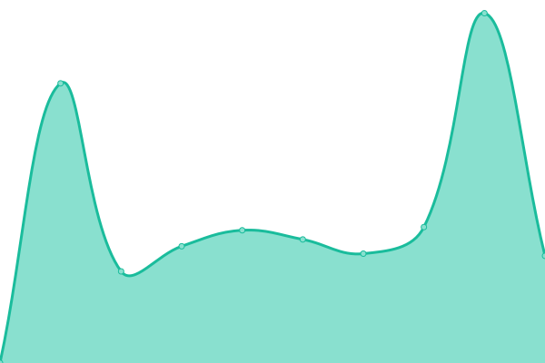 1453ms
     
 | 

<a href="https://demo.upptime.js.org/history/cerrajeroalfafar-es">100.00%</a>
    

|  [cerrajeroalmassera.es](https://cerrajeroalmassera.es) | 🟩 Up | [cerrajeroalmassera-es.yml](https://github.com/pmo-2025/status-pmo/commits/HEAD/history/cerrajeroalmassera-es.yml) | 

 2119ms
     
 | 

<a href="https://demo.upptime.js.org/history/cerrajeroalmassera-es">100.00%</a>
    

|  [cerrajeroalzira.com](https://cerrajeroalzira.com) | 🟩 Up | [cerrajeroalzira-com.yml](https://github.com/pmo-2025/status-pmo/commits/HEAD/history/cerrajeroalzira-com.yml) | 

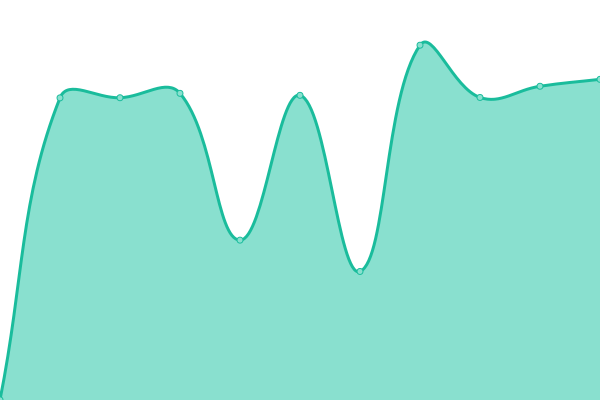 2228ms
     
 | 

<a href="https://demo.upptime.js.org/history/cerrajeroalzira-com">100.00%</a>
    

|  [cerrajerobenetusser.com](https://cerrajerobenetusser.com) | 🟩 Up | [cerrajerobenetusser-com.yml](https://github.com/pmo-2025/status-pmo/commits/HEAD/history/cerrajerobenetusser-com.yml) | 

 2123ms
     
 | 

<a href="https://demo.upptime.js.org/history/cerrajerobenetusser-com">100.00%</a>
    

|  [cerrajerobetera.com](https://cerrajerobetera.com) | 🟩 Up | [cerrajerobetera-com.yml](https://github.com/pmo-2025/status-pmo/commits/HEAD/history/cerrajerobetera-com.yml) | 

 959ms
     
 | 

<a href="https://demo.upptime.js.org/history/cerrajerobetera-com">100.00%</a>
    

|  [cerrajerobetera.es](https://cerrajerobetera.es) | 🟩 Up | [cerrajerobetera-es.yml](https://github.com/pmo-2025/status-pmo/commits/HEAD/history/cerrajerobetera-es.yml) | 

 1783ms
     
 | 

<a href="https://demo.upptime.js.org/history/cerrajerobetera-es">100.00%</a>
    

|  [cerrajeroburjassot.com](https://cerrajeroburjassot.com) | 🟩 Up | [cerrajeroburjassot-com.yml](https://github.com/pmo-2025/status-pmo/commits/HEAD/history/cerrajeroburjassot-com.yml) | 

 976ms
     
 | 

<a href="https://demo.upptime.js.org/history/cerrajeroburjassot-com">100.00%</a>
    

|  [cerrajerocanetdeberenguer.es](https://cerrajerocanetdeberenguer.es) | 🟩 Up | [cerrajerocanetdeberenguer-es.yml](https://github.com/pmo-2025/status-pmo/commits/HEAD/history/cerrajerocanetdeberenguer-es.yml) | 

 1990ms
     
 | 

<a href="https://demo.upptime.js.org/history/cerrajerocanetdeberenguer-es">100.00%</a>
    

|  [cerrajerocarlet.com](https://cerrajerocarlet.com) | 🟩 Up | [cerrajerocarlet-com.yml](https://github.com/pmo-2025/status-pmo/commits/HEAD/history/cerrajerocarlet-com.yml) | 

 990ms
     
 | 

<a href="https://demo.upptime.js.org/history/cerrajerocarlet-com">100.00%</a>
    

|  [cerrajerocatarroja.com](https://cerrajerocatarroja.com) | 🟩 Up | [cerrajerocatarroja-com.yml](https://github.com/pmo-2025/status-pmo/commits/HEAD/history/cerrajerocatarroja-com.yml) | 

 2212ms
     
 | 

<a href="https://demo.upptime.js.org/history/cerrajerocatarroja-com">100.00%</a>
    

|  [cerrajerocheste.es](https://cerrajerocheste.es) | 🟩 Up | [cerrajerocheste-es.yml](https://github.com/pmo-2025/status-pmo/commits/HEAD/history/cerrajerocheste-es.yml) | 

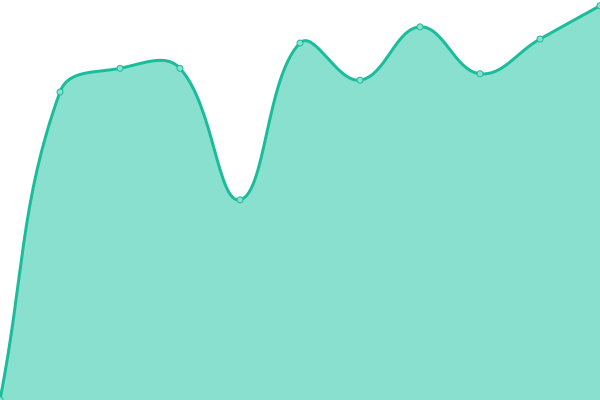 2187ms
     
 | 

<a href="https://demo.upptime.js.org/history/cerrajerocheste-es">100.00%</a>
    

|  [cerrajerocullera.com](https://cerrajerocullera.com) | 🟩 Up | [cerrajerocullera-com.yml](https://github.com/pmo-2025/status-pmo/commits/HEAD/history/cerrajerocullera-com.yml) | 

 1198ms
     
 | 

<a href="https://demo.upptime.js.org/history/cerrajerocullera-com">100.00%</a>
    

|  [cerrajerodealaquas.com](https://cerrajerodealaquas.com) | 🟩 Up | [cerrajerodealaquas-com.yml](https://github.com/pmo-2025/status-pmo/commits/HEAD/history/cerrajerodealaquas-com.yml) | 

 975ms
     
 | 

<a href="https://demo.upptime.js.org/history/cerrajerodealaquas-com">100.00%</a>
    

|  [cerrajerodealbal.com](https://cerrajerodealbal.com) | 🟩 Up | [cerrajerodealbal-com.yml](https://github.com/pmo-2025/status-pmo/commits/HEAD/history/cerrajerodealbal-com.yml) | 

 880ms
     
 | 

<a href="https://demo.upptime.js.org/history/cerrajerodealbal-com">100.00%</a>
    

|  [cerrajerodealboraya.com](https://cerrajerodealboraya.com) | 🟩 Up | [cerrajerodealboraya-com.yml](https://github.com/pmo-2025/status-pmo/commits/HEAD/history/cerrajerodealboraya-com.yml) | 

 1030ms
     
 | 

<a href="https://demo.upptime.js.org/history/cerrajerodealboraya-com">100.00%</a>
    

|  [cerrajerodealdaia.com](https://cerrajerodealdaia.com) | 🟩 Up | [cerrajerodealdaia-com.yml](https://github.com/pmo-2025/status-pmo/commits/HEAD/history/cerrajerodealdaia-com.yml) | 

 981ms
     
 | 

<a href="https://demo.upptime.js.org/history/cerrajerodealdaia-com">100.00%</a>
    

|  [cerrajerodealfafar.com](https://cerrajerodealfafar.com) | 🟩 Up | [cerrajerodealfafar-com.yml](https://github.com/pmo-2025/status-pmo/commits/HEAD/history/cerrajerodealfafar-com.yml) | 

 985ms
     
 | 

<a href="https://demo.upptime.js.org/history/cerrajerodealfafar-com">100.00%</a>
    

|  [cerrajerodealzira.com](https://cerrajerodealzira.com) | 🟩 Up | [cerrajerodealzira-com.yml](https://github.com/pmo-2025/status-pmo/commits/HEAD/history/cerrajerodealzira-com.yml) | 

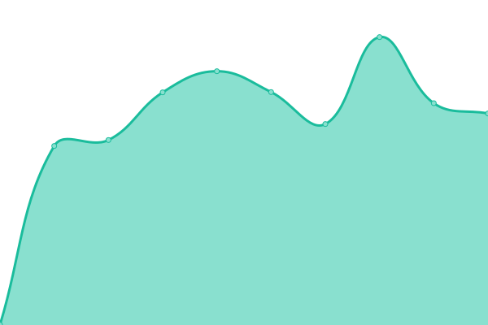 986ms
     
 | 

<a href="https://demo.upptime.js.org/history/cerrajerodealzira-com">100.00%</a>
    

|  [cerrajerodebenetusser.com](https://cerrajerodebenetusser.com) | 🟩 Up | [cerrajerodebenetusser-com.yml](https://github.com/pmo-2025/status-pmo/commits/HEAD/history/cerrajerodebenetusser-com.yml) | 

 1002ms
     
 | 

<a href="https://demo.upptime.js.org/history/cerrajerodebenetusser-com">100.00%</a>
    

|  [cerrajerodebetera.com](https://cerrajerodebetera.com) | 🟩 Up | [cerrajerodebetera-com.yml](https://github.com/pmo-2025/status-pmo/commits/HEAD/history/cerrajerodebetera-com.yml) | 

 874ms
     
 | 

<a href="https://demo.upptime.js.org/history/cerrajerodebetera-com">100.00%</a>
    

|  [cerrajerodecalpe.com](https://cerrajerodecalpe.com) | 🟩 Up | [cerrajerodecalpe-com.yml](https://github.com/pmo-2025/status-pmo/commits/HEAD/history/cerrajerodecalpe-com.yml) | 

 2327ms
     
 | 

<a href="https://demo.upptime.js.org/history/cerrajerodecalpe-com">100.00%</a>
    

|  [cerrajerodecatarroja.com](https://cerrajerodecatarroja.com) | 🟩 Up | [cerrajerodecatarroja-com.yml](https://github.com/pmo-2025/status-pmo/commits/HEAD/history/cerrajerodecatarroja-com.yml) | 

 981ms
     
 | 

<a href="https://demo.upptime.js.org/history/cerrajerodecatarroja-com">100.00%</a>
    

|  [cerrajerodeeliana.com](https://cerrajerodeeliana.com) | 🟩 Up | [cerrajerodeeliana-com.yml](https://github.com/pmo-2025/status-pmo/commits/HEAD/history/cerrajerodeeliana-com.yml) | 

 1080ms
     
 | 

<a href="https://demo.upptime.js.org/history/cerrajerodeeliana-com">100.00%</a>
    

|  [cerrajerodegandia.com](https://cerrajerodegandia.com) | 🟩 Up | [cerrajerodegandia-com.yml](https://github.com/pmo-2025/status-pmo/commits/HEAD/history/cerrajerodegandia-com.yml) | 

 1050ms
     
 | 

<a href="https://demo.upptime.js.org/history/cerrajerodegandia-com">100.00%</a>
    

|  [cerrajerodegodella.com](https://cerrajerodegodella.com) | 🟩 Up | [cerrajerodegodella-com.yml](https://github.com/pmo-2025/status-pmo/commits/HEAD/history/cerrajerodegodella-com.yml) | 

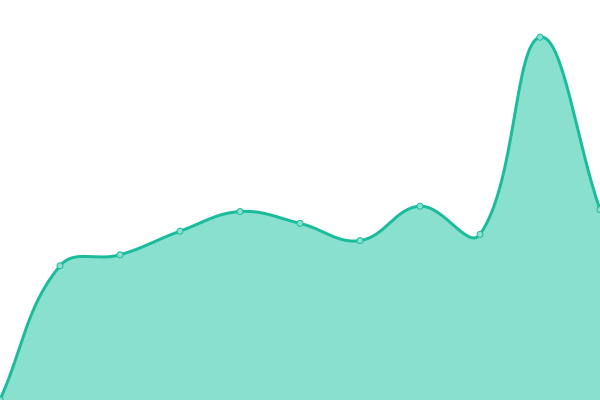 992ms
     
 | 

<a href="https://demo.upptime.js.org/history/cerrajerodegodella-com">100.00%</a>
    

|  [cerrajerodelapobladefarnals.com](https://cerrajerodelapobladefarnals.com) | 🟩 Up | [cerrajerodelapobladefarnals-com.yml](https://github.com/pmo-2025/status-pmo/commits/HEAD/history/cerrajerodelapobladefarnals-com.yml) | 

 989ms
     
 | 

<a href="https://demo.upptime.js.org/history/cerrajerodelapobladefarnals-com">100.00%</a>
    

|  [cerrajerodelapobladevallbona.com](https://cerrajerodelapobladevallbona.com) | 🟩 Up | [cerrajerodelapobladevallbona-com.yml](https://github.com/pmo-2025/status-pmo/commits/HEAD/history/cerrajerodelapobladevallbona-com.yml) | 

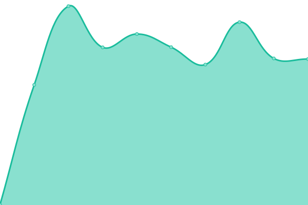 1033ms
     
 | 

<a href="https://demo.upptime.js.org/history/cerrajerodelapobladevallbona-com">100.00%</a>
    

|  [cerrajerodelpuig.com](https://cerrajerodelpuig.com) | 🟩 Up | [cerrajerodelpuig-com.yml](https://github.com/pmo-2025/status-pmo/commits/HEAD/history/cerrajerodelpuig-com.yml) | 

 1038ms
     
 | 

<a href="https://demo.upptime.js.org/history/cerrajerodelpuig-com">100.00%</a>
    

|  [cerrajerodemanises.com](https://cerrajerodemanises.com) | 🟩 Up | [cerrajerodemanises-com.yml](https://github.com/pmo-2025/status-pmo/commits/HEAD/history/cerrajerodemanises-com.yml) | 

 993ms
     
 | 

<a href="https://demo.upptime.js.org/history/cerrajerodemanises-com">100.00%</a>
    

|  [cerrajerodemassanassa.com](https://cerrajerodemassanassa.com) | 🟩 Up | [cerrajerodemassanassa-com.yml](https://github.com/pmo-2025/status-pmo/commits/HEAD/history/cerrajerodemassanassa-com.yml) | 

 1028ms
     
 | 

<a href="https://demo.upptime.js.org/history/cerrajerodemassanassa-com">100.00%</a>
    

|  [cerrajerodemeliana.com](https://cerrajerodemeliana.com) | 🟩 Up | [cerrajerodemeliana-com.yml](https://github.com/pmo-2025/status-pmo/commits/HEAD/history/cerrajerodemeliana-com.yml) | 

 986ms
     
 | 

<a href="https://demo.upptime.js.org/history/cerrajerodemeliana-com">100.00%</a>
    

|  [cerrajerodemislata.com](https://cerrajerodemislata.com) | 🟩 Up | [cerrajerodemislata-com.yml](https://github.com/pmo-2025/status-pmo/commits/HEAD/history/cerrajerodemislata-com.yml) | 

 874ms
     
 | 

<a href="https://demo.upptime.js.org/history/cerrajerodemislata-com">100.00%</a>
    

|  [cerrajerodemoncada.com](https://cerrajerodemoncada.com) | 🟩 Up | [cerrajerodemoncada-com.yml](https://github.com/pmo-2025/status-pmo/commits/HEAD/history/cerrajerodemoncada-com.yml) | 

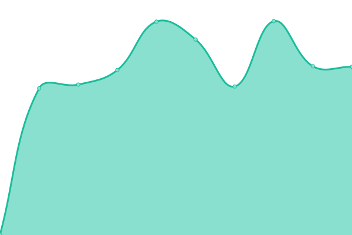 867ms
     
 | 

<a href="https://demo.upptime.js.org/history/cerrajerodemoncada-com">100.00%</a>
    

|  [cerrajerodemuseros.com](https://cerrajerodemuseros.com) | 🟩 Up | [cerrajerodemuseros-com.yml](https://github.com/pmo-2025/status-pmo/commits/HEAD/history/cerrajerodemuseros-com.yml) | 

 1025ms
     
 | 

<a href="https://demo.upptime.js.org/history/cerrajerodemuseros-com">100.00%</a>
    

|  [cerrajerodepaiporta.com](https://cerrajerodepaiporta.com) | 🟩 Up | [cerrajerodepaiporta-com.yml](https://github.com/pmo-2025/status-pmo/commits/HEAD/history/cerrajerodepaiporta-com.yml) | 

 1027ms
     
 | 

<a href="https://demo.upptime.js.org/history/cerrajerodepaiporta-com">100.00%</a>
    

|  [cerrajerodepaterna.com](https://cerrajerodepaterna.com) | 🟩 Up | [cerrajerodepaterna-com.yml](https://github.com/pmo-2025/status-pmo/commits/HEAD/history/cerrajerodepaterna-com.yml) | 

 1022ms
     
 | 

<a href="https://demo.upptime.js.org/history/cerrajerodepaterna-com">100.00%</a>
    

|  [cerrajerodequartdepoblet.com](https://cerrajerodequartdepoblet.com) | 🟩 Up | [cerrajerodequartdepoblet-com.yml](https://github.com/pmo-2025/status-pmo/commits/HEAD/history/cerrajerodequartdepoblet-com.yml) | 

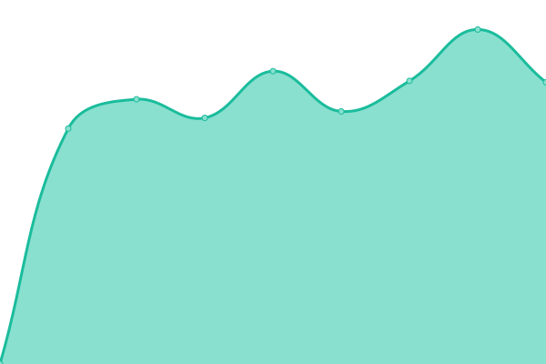 1946ms
     
 | 

<a href="https://demo.upptime.js.org/history/cerrajerodequartdepoblet-com">100.00%</a>
    

|  [cerrajeroderocafort.com](https://cerrajeroderocafort.com) | 🟩 Up | [cerrajeroderocafort-com.yml](https://github.com/pmo-2025/status-pmo/commits/HEAD/history/cerrajeroderocafort-com.yml) | 

 967ms
     
 | 

<a href="https://demo.upptime.js.org/history/cerrajeroderocafort-com">100.00%</a>
    

|  [cerrajerodesagunto.es](https://cerrajerodesagunto.es) | 🟩 Up | [cerrajerodesagunto-es.yml](https://github.com/pmo-2025/status-pmo/commits/HEAD/history/cerrajerodesagunto-es.yml) | 

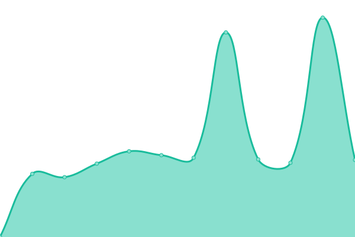 1122ms
     
 | 

<a href="https://demo.upptime.js.org/history/cerrajerodesagunto-es">100.00%</a>
    

|  [cerrajerodesilla.com](https://cerrajerodesilla.com) | 🟩 Up | [cerrajerodesilla-com.yml](https://github.com/pmo-2025/status-pmo/commits/HEAD/history/cerrajerodesilla-com.yml) | 

 992ms
     
 | 

<a href="https://demo.upptime.js.org/history/cerrajerodesilla-com">100.00%</a>
    

|  [cerrajerodesueca.com](https://cerrajerodesueca.com) | 🟩 Up | [cerrajerodesueca-com.yml](https://github.com/pmo-2025/status-pmo/commits/HEAD/history/cerrajerodesueca-com.yml) | 

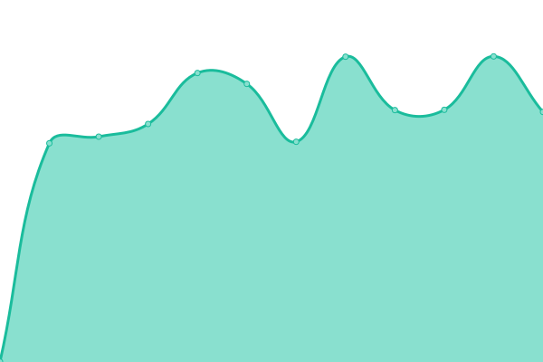 1096ms
     
 | 

<a href="https://demo.upptime.js.org/history/cerrajerodesueca-com">100.00%</a>
    

|  [cerrajerodetorrente.com](https://cerrajerodetorrente.com) | 🟩 Up | [cerrajerodetorrente-com.yml](https://github.com/pmo-2025/status-pmo/commits/HEAD/history/cerrajerodetorrente-com.yml) | 

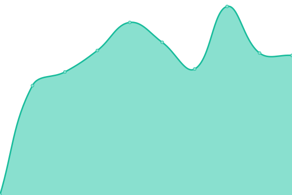 977ms
     
 | 

<a href="https://demo.upptime.js.org/history/cerrajerodetorrente-com">100.00%</a>
    

|  [cerrajerodevalencia.com](https://cerrajerodevalencia.com) | 🟩 Up | [cerrajerodevalencia-com.yml](https://github.com/pmo-2025/status-pmo/commits/HEAD/history/cerrajerodevalencia-com.yml) | 

 3075ms
     
 | 

<a href="https://demo.upptime.js.org/history/cerrajerodevalencia-com">100.00%</a>
    

|  [cerrajero-de-valencia.com](https://cerrajero-de-valencia.com) | 🟩 Up | [cerrajero-de-valencia-com.yml](https://github.com/pmo-2025/status-pmo/commits/HEAD/history/cerrajero-de-valencia-com.yml) | 

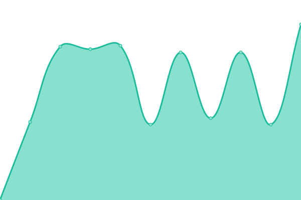 1513ms
     
 | 

<a href="https://demo.upptime.js.org/history/cerrajero-de-valencia-com">100.00%</a>
    

|  [cerrajerodevalencia.es](https://cerrajerodevalencia.es) | 🟩 Up | [cerrajerodevalencia-es.yml](https://github.com/pmo-2025/status-pmo/commits/HEAD/history/cerrajerodevalencia-es.yml) | 

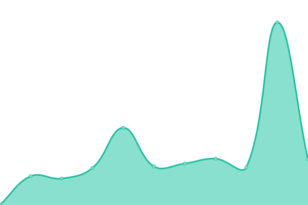 1006ms
     
 | 

<a href="https://demo.upptime.js.org/history/cerrajerodevalencia-es">100.00%</a>
    

|  [cerrajerodevalencia.net](https://cerrajerodevalencia.net) | 🟩 Up | [cerrajerodevalencia-net.yml](https://github.com/pmo-2025/status-pmo/commits/HEAD/history/cerrajerodevalencia-net.yml) | 

 2118ms
     
 | 

<a href="https://demo.upptime.js.org/history/cerrajerodevalencia-net">100.00%</a>
    

|  [cerrajerodevalenciabarato.com](https://cerrajerodevalenciabarato.com) | 🟩 Up | [cerrajerodevalenciabarato-com.yml](https://github.com/pmo-2025/status-pmo/commits/HEAD/history/cerrajerodevalenciabarato-com.yml) | 

 1118ms
     
 | 

<a href="https://demo.upptime.js.org/history/cerrajerodevalenciabarato-com">100.00%</a>
    

|  [cerrajeroelpuig.es](https://cerrajeroelpuig.es) | 🟩 Up | [cerrajeroelpuig-es.yml](https://github.com/pmo-2025/status-pmo/commits/HEAD/history/cerrajeroelpuig-es.yml) | 

 2078ms
     
 | 

<a href="https://demo.upptime.js.org/history/cerrajeroelpuig-es">100.00%</a>
    

|  [cerrajeroenburjassot.es](https://cerrajeroenburjassot.es) | 🟩 Up | [cerrajeroenburjassot-es.yml](https://github.com/pmo-2025/status-pmo/commits/HEAD/history/cerrajeroenburjassot-es.yml) | 

 2360ms
     
 | 

<a href="https://demo.upptime.js.org/history/cerrajeroenburjassot-es">100.00%</a>
    

|  [cerrajeroenmislata.es](https://cerrajeroenmislata.es) | 🟩 Up | [cerrajeroenmislata-es.yml](https://github.com/pmo-2025/status-pmo/commits/HEAD/history/cerrajeroenmislata-es.yml) | 

 2039ms
     
 | 

<a href="https://demo.upptime.js.org/history/cerrajeroenmislata-es">100.00%</a>
    

|  [cerrajerogandia.com](https://cerrajerogandia.com) | 🟩 Up | [cerrajerogandia-com.yml](https://github.com/pmo-2025/status-pmo/commits/HEAD/history/cerrajerogandia-com.yml) | 

 2502ms
     
 | 

<a href="https://demo.upptime.js.org/history/cerrajerogandia-com">100.00%</a>
    

|  [cerrajerogodella.com](https://cerrajerogodella.com) | 🟩 Up | [cerrajerogodella-com.yml](https://github.com/pmo-2025/status-pmo/commits/HEAD/history/cerrajerogodella-com.yml) | 

 1228ms
     
 | 

<a href="https://demo.upptime.js.org/history/cerrajerogodella-com">100.00%</a>
    

|  [cerrajerogodella.es](https://cerrajerogodella.es) | 🟩 Up | [cerrajerogodella-es.yml](https://github.com/pmo-2025/status-pmo/commits/HEAD/history/cerrajerogodella-es.yml) | 

 2323ms
     
 | 

<a href="https://demo.upptime.js.org/history/cerrajerogodella-es">100.00%</a>
    

|  [cerrajerogodelleta.es](https://cerrajerogodelleta.es) | 🟩 Up | [cerrajerogodelleta-es.yml](https://github.com/pmo-2025/status-pmo/commits/HEAD/history/cerrajerogodelleta-es.yml) | 

 2170ms
     
 | 

<a href="https://demo.upptime.js.org/history/cerrajerogodelleta-es">100.00%</a>
    

|  [cerrajerolaeliana.com](https://cerrajerolaeliana.com) | 🟩 Up | [cerrajerolaeliana-com.yml](https://github.com/pmo-2025/status-pmo/commits/HEAD/history/cerrajerolaeliana-com.yml) | 

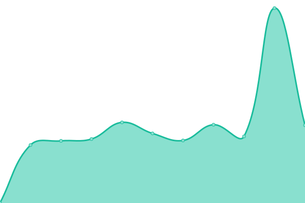 1192ms
     
 | 

<a href="https://demo.upptime.js.org/history/cerrajerolaeliana-com">100.00%</a>
    

|  [cerrajerolaeliana.es](https://cerrajerolaeliana.es) | 🟩 Up | [cerrajerolaeliana-es.yml](https://github.com/pmo-2025/status-pmo/commits/HEAD/history/cerrajerolaeliana-es.yml) | 

 2000ms
     
 | 

<a href="https://demo.upptime.js.org/history/cerrajerolaeliana-es">100.00%</a>
    

|  [cerrajerolliria.es](https://cerrajerolliria.es) | 🟩 Up | [cerrajerolliria-es.yml](https://github.com/pmo-2025/status-pmo/commits/HEAD/history/cerrajerolliria-es.yml) | 

 2216ms
     
 | 

<a href="https://demo.upptime.js.org/history/cerrajerolliria-es">100.00%</a>
    

|  [cerrajeromanises.com](https://cerrajeromanises.com) | 🟩 Up | [cerrajeromanises-com.yml](https://github.com/pmo-2025/status-pmo/commits/HEAD/history/cerrajeromanises-com.yml) | 

 1607ms
     
 | 

<a href="https://demo.upptime.js.org/history/cerrajeromanises-com">100.00%</a>
    

|  [cerrajeromanises.es](https://cerrajeromanises.es) | 🟩 Up | [cerrajeromanises-es.yml](https://github.com/pmo-2025/status-pmo/commits/HEAD/history/cerrajeromanises-es.yml) | 

 2145ms
     
 | 

<a href="https://demo.upptime.js.org/history/cerrajeromanises-es">100.00%</a>
    

|  [cerrajeromassamagrell.es](https://cerrajeromassamagrell.es) | 🟩 Up | [cerrajeromassamagrell-es.yml](https://github.com/pmo-2025/status-pmo/commits/HEAD/history/cerrajeromassamagrell-es.yml) | 

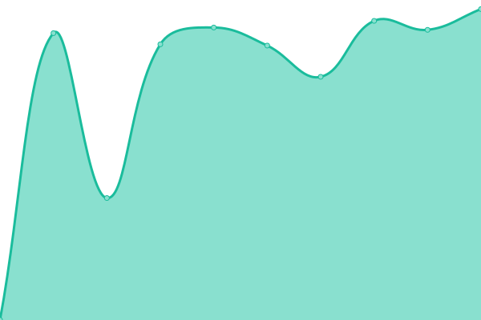 2179ms
     
 | 

<a href="https://demo.upptime.js.org/history/cerrajeromassamagrell-es">100.00%</a>
    

|  [cerrajeromeliana.es](https://cerrajeromeliana.es) | 🟩 Up | [cerrajeromeliana-es.yml](https://github.com/pmo-2025/status-pmo/commits/HEAD/history/cerrajeromeliana-es.yml) | 

 1606ms
     
 | 

<a href="https://demo.upptime.js.org/history/cerrajeromeliana-es">100.00%</a>
    

|  [cerrajeromoncada.es](https://cerrajeromoncada.es) | 🟩 Up | [cerrajeromoncada-es.yml](https://github.com/pmo-2025/status-pmo/commits/HEAD/history/cerrajeromoncada-es.yml) | 

 1022ms
     
 | 

<a href="https://demo.upptime.js.org/history/cerrajeromoncada-es">100.00%</a>
    

|  [cerrajeronaquera.es](https://cerrajeronaquera.es) | 🟩 Up | [cerrajeronaquera-es.yml](https://github.com/pmo-2025/status-pmo/commits/HEAD/history/cerrajeronaquera-es.yml) | 

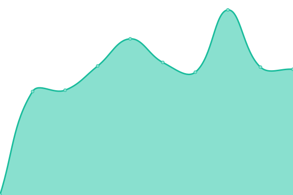 963ms
     
 | 

<a href="https://demo.upptime.js.org/history/cerrajeronaquera-es">100.00%</a>
    

|  [cerrajeropaiporta.com](https://cerrajeropaiporta.com) | 🟩 Up | [cerrajeropaiporta-com.yml](https://github.com/pmo-2025/status-pmo/commits/HEAD/history/cerrajeropaiporta-com.yml) | 

 1048ms
     
 | 

<a href="https://demo.upptime.js.org/history/cerrajeropaiporta-com">100.00%</a>
    

|  [cerrajeropaterna.es](https://cerrajeropaterna.es) | 🟩 Up | [cerrajeropaterna-es.yml](https://github.com/pmo-2025/status-pmo/commits/HEAD/history/cerrajeropaterna-es.yml) | 

 2204ms
     
 | 

<a href="https://demo.upptime.js.org/history/cerrajeropaterna-es">100.00%</a>
    

|  [cerrajeropersianerovalencia.com](https://cerrajeropersianerovalencia.com) | 🟩 Up | [cerrajeropersianerovalencia-com.yml](https://github.com/pmo-2025/status-pmo/commits/HEAD/history/cerrajeropersianerovalencia-com.yml) | 

 973ms
     
 | 

<a href="https://demo.upptime.js.org/history/cerrajeropersianerovalencia-com">100.00%</a>
    

|  [cerrajeropuzol.com](https://cerrajeropuzol.com) | 🟩 Up | [cerrajeropuzol-com.yml](https://github.com/pmo-2025/status-pmo/commits/HEAD/history/cerrajeropuzol-com.yml) | 

 979ms
     
 | 

<a href="https://demo.upptime.js.org/history/cerrajeropuzol-com">100.00%</a>
    

|  [cerrajeroquartdepoblet.com](https://cerrajeroquartdepoblet.com) | 🟩 Up | [cerrajeroquartdepoblet-com.yml](https://github.com/pmo-2025/status-pmo/commits/HEAD/history/cerrajeroquartdepoblet-com.yml) | 

 1060ms
     
 | 

<a href="https://demo.upptime.js.org/history/cerrajeroquartdepoblet-com">100.00%</a>
    

|  [cerrajeroquartdepoblet.es](https://cerrajeroquartdepoblet.es) | 🟩 Up | [cerrajeroquartdepoblet-es.yml](https://github.com/pmo-2025/status-pmo/commits/HEAD/history/cerrajeroquartdepoblet-es.yml) | 

 1977ms
     
 | 

<a href="https://demo.upptime.js.org/history/cerrajeroquartdepoblet-es">100.00%</a>
    

|  [cerrajeroribarrojadelturia.es](https://cerrajeroribarrojadelturia.es) | 🟩 Up | [cerrajeroribarrojadelturia-es.yml](https://github.com/pmo-2025/status-pmo/commits/HEAD/history/cerrajeroribarrojadelturia-es.yml) | 

 2108ms
     
 | 

<a href="https://demo.upptime.js.org/history/cerrajeroribarrojadelturia-es">100.00%</a>
    

|  [cerrajerorocafort.com](https://cerrajerorocafort.com) | 🟩 Up | [cerrajerorocafort-com.yml](https://github.com/pmo-2025/status-pmo/commits/HEAD/history/cerrajerorocafort-com.yml) | 

 987ms
     
 | 

<a href="https://demo.upptime.js.org/history/cerrajerorocafort-com">100.00%</a>
    

|  [cerrajerorocafort.es](https://cerrajerorocafort.es) | 🟩 Up | [cerrajerorocafort-es.yml](https://github.com/pmo-2025/status-pmo/commits/HEAD/history/cerrajerorocafort-es.yml) | 

 1035ms
     
 | 

<a href="https://demo.upptime.js.org/history/cerrajerorocafort-es">100.00%</a>
    

|  [cerrajerorolapobladevallbona.es](https://cerrajerorolapobladevallbona.es) | 🟩 Up | [cerrajerorolapobladevallbona-es.yml](https://github.com/pmo-2025/status-pmo/commits/HEAD/history/cerrajerorolapobladevallbona-es.yml) | 

 1672ms
     
 | 

<a href="https://demo.upptime.js.org/history/cerrajerorolapobladevallbona-es">100.00%</a>
    

|  [cerrajeroropicanya.es](https://cerrajeroropicanya.es) | 🟩 Up | [cerrajeroropicanya-es.yml](https://github.com/pmo-2025/status-pmo/commits/HEAD/history/cerrajeroropicanya-es.yml) | 

 1669ms
     
 | 

<a href="https://demo.upptime.js.org/history/cerrajeroropicanya-es">100.00%</a>
    

|  [cerrajeros24horasvalencia.com](https://cerrajeros24horasvalencia.com) | 🟩 Up | [cerrajeros24horasvalencia-com.yml](https://github.com/pmo-2025/status-pmo/commits/HEAD/history/cerrajeros24horasvalencia-com.yml) | 

 903ms
     
 | 

<a href="https://demo.upptime.js.org/history/cerrajeros24horasvalencia-com">100.00%</a>
    

|  [cerrajerosalbal.com](https://cerrajerosalbal.com) | 🟩 Up | [cerrajerosalbal-com.yml](https://github.com/pmo-2025/status-pmo/commits/HEAD/history/cerrajerosalbal-com.yml) | 

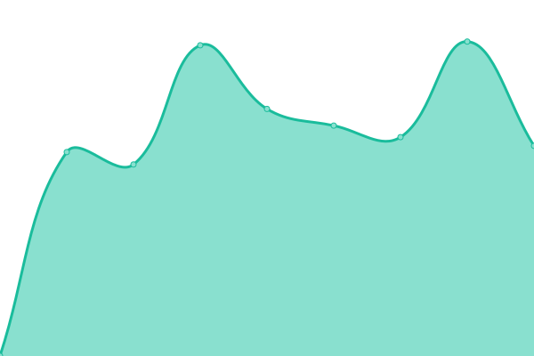 1782ms
     
 | 

<a href="https://demo.upptime.js.org/history/cerrajerosalbal-com">100.00%</a>
    

|  [cerrajerosalboraya.com](https://cerrajerosalboraya.com) | 🟩 Up | [cerrajerosalboraya-com.yml](https://github.com/pmo-2025/status-pmo/commits/HEAD/history/cerrajerosalboraya-com.yml) | 

 967ms
     
 | 

<a href="https://demo.upptime.js.org/history/cerrajerosalboraya-com">100.00%</a>
    

|  [cerrajerosalcasser.com](https://cerrajerosalcasser.com) | 🟩 Up | [cerrajerosalcasser-com.yml](https://github.com/pmo-2025/status-pmo/commits/HEAD/history/cerrajerosalcasser-com.yml) | 

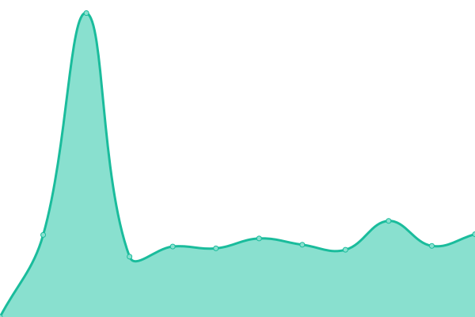 4430ms
     
 | 

<a href="https://demo.upptime.js.org/history/cerrajerosalcasser-com">100.00%</a>
    

|  [cerrajerosalfafar.com](https://cerrajerosalfafar.com) | 🟩 Up | [cerrajerosalfafar-com.yml](https://github.com/pmo-2025/status-pmo/commits/HEAD/history/cerrajerosalfafar-com.yml) | 

 2889ms
     
 | 

<a href="https://demo.upptime.js.org/history/cerrajerosalfafar-com">100.00%</a>
    

|  [cerrajerosalfaradelpatriarca.com](https://cerrajerosalfaradelpatriarca.com) | 🟩 Up | [cerrajerosalfaradelpatriarca-com.yml](https://github.com/pmo-2025/status-pmo/commits/HEAD/history/cerrajerosalfaradelpatriarca-com.yml) | 

 3046ms
     
 | 

<a href="https://demo.upptime.js.org/history/cerrajerosalfaradelpatriarca-com">100.00%</a>
    

|  [cerrajerosalmassera.com](https://cerrajerosalmassera.com) | 🟩 Up | [cerrajerosalmassera-com.yml](https://github.com/pmo-2025/status-pmo/commits/HEAD/history/cerrajerosalmassera-com.yml) | 

 926ms
     
 | 

<a href="https://demo.upptime.js.org/history/cerrajerosalmassera-com">100.00%</a>
    

|  [cerrajerosbenaguasil.com](https://cerrajerosbenaguasil.com) | 🟩 Up | [cerrajerosbenaguasil-com.yml](https://github.com/pmo-2025/status-pmo/commits/HEAD/history/cerrajerosbenaguasil-com.yml) | 

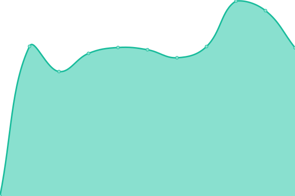 2466ms
     
 | 

<a href="https://demo.upptime.js.org/history/cerrajerosbenaguasil-com">100.00%</a>
    

|  [cerrajerosbenetusser.com](https://cerrajerosbenetusser.com) | 🟩 Up | [cerrajerosbenetusser-com.yml](https://github.com/pmo-2025/status-pmo/commits/HEAD/history/cerrajerosbenetusser-com.yml) | 

 919ms
     
 | 

<a href="https://demo.upptime.js.org/history/cerrajerosbenetusser-com">100.00%</a>
    

|  [cerrajeroscanetdeberenguer.com](https://cerrajeroscanetdeberenguer.com) | 🟩 Up | [cerrajeroscanetdeberenguer-com.yml](https://github.com/pmo-2025/status-pmo/commits/HEAD/history/cerrajeroscanetdeberenguer-com.yml) | 

 2150ms
     
 | 

<a href="https://demo.upptime.js.org/history/cerrajeroscanetdeberenguer-com">100.00%</a>
    

|  [cerrajeroscarlet.com](https://cerrajeroscarlet.com) | 🟩 Up | [cerrajeroscarlet-com.yml](https://github.com/pmo-2025/status-pmo/commits/HEAD/history/cerrajeroscarlet-com.yml) | 

 917ms
     
 | 

<a href="https://demo.upptime.js.org/history/cerrajeroscarlet-com">100.00%</a>
    

|  [cerrajeroscatarroja.com](https://cerrajeroscatarroja.com) | 🟩 Up | [cerrajeroscatarroja-com.yml](https://github.com/pmo-2025/status-pmo/commits/HEAD/history/cerrajeroscatarroja-com.yml) | 

 920ms
     
 | 

<a href="https://demo.upptime.js.org/history/cerrajeroscatarroja-com">100.00%</a>
    

|  [cerrajeroscheste.com](https://cerrajeroscheste.com) | 🟩 Up | [cerrajeroscheste-com.yml](https://github.com/pmo-2025/status-pmo/commits/HEAD/history/cerrajeroscheste-com.yml) | 

 957ms
     
 | 

<a href="https://demo.upptime.js.org/history/cerrajeroscheste-com">100.00%</a>
    

|  [cerrajeroschiva.com](https://cerrajeroschiva.com) | 🟩 Up | [cerrajeroschiva-com.yml](https://github.com/pmo-2025/status-pmo/commits/HEAD/history/cerrajeroschiva-com.yml) | 

 2763ms
     
 | 

<a href="https://demo.upptime.js.org/history/cerrajeroschiva-com">100.00%</a>
    

|  [cerrajerosdealdaia.com](https://cerrajerosdealdaia.com) | 🟩 Up | [cerrajerosdealdaia-com.yml](https://github.com/pmo-2025/status-pmo/commits/HEAD/history/cerrajerosdealdaia-com.yml) | 

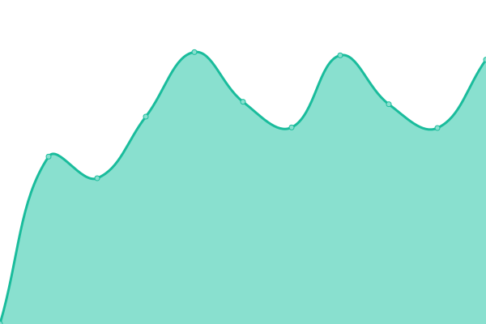 971ms
     
 | 

<a href="https://demo.upptime.js.org/history/cerrajerosdealdaia-com">100.00%</a>
    

|  [cerrajerosdeburjasot.com](https://cerrajerosdeburjasot.com) | 🟩 Up | [cerrajerosdeburjasot-com.yml](https://github.com/pmo-2025/status-pmo/commits/HEAD/history/cerrajerosdeburjasot-com.yml) | 

 1103ms
     
 | 

<a href="https://demo.upptime.js.org/history/cerrajerosdeburjasot-com">100.00%</a>
    

|  [cerrajerosdemanises.com](https://cerrajerosdemanises.com) | 🟩 Up | [cerrajerosdemanises-com.yml](https://github.com/pmo-2025/status-pmo/commits/HEAD/history/cerrajerosdemanises-com.yml) | 

 982ms
     
 | 

<a href="https://demo.upptime.js.org/history/cerrajerosdemanises-com">100.00%</a>
    

|  [cerrajerosdemislata.com](https://cerrajerosdemislata.com) | 🟩 Up | [cerrajerosdemislata-com.yml](https://github.com/pmo-2025/status-pmo/commits/HEAD/history/cerrajerosdemislata-com.yml) | 

 964ms
     
 | 

<a href="https://demo.upptime.js.org/history/cerrajerosdemislata-com">100.00%</a>
    

|  [cerrajerosdesagunto.com](https://cerrajerosdesagunto.com) | 🟩 Up | [cerrajerosdesagunto-com.yml](https://github.com/pmo-2025/status-pmo/commits/HEAD/history/cerrajerosdesagunto-com.yml) | 

 1192ms
     
 | 

<a href="https://demo.upptime.js.org/history/cerrajerosdesagunto-com">100.00%</a>
    

|  [cerrajerosdevalenciacapital.com](https://cerrajerosdevalenciacapital.com) | 🟩 Up | [cerrajerosdevalenciacapital-com.yml](https://github.com/pmo-2025/status-pmo/commits/HEAD/history/cerrajerosdevalenciacapital-com.yml) | 

 2388ms
     
 | 

<a href="https://demo.upptime.js.org/history/cerrajerosdevalenciacapital-com">100.00%</a>
    

|  [cerrajerosedavi.es](https://cerrajerosedavi.es) | 🟩 Up | [cerrajerosedavi-es.yml](https://github.com/pmo-2025/status-pmo/commits/HEAD/history/cerrajerosedavi-es.yml) | 

 1682ms
     
 | 

<a href="https://demo.upptime.js.org/history/cerrajerosedavi-es">100.00%</a>
    

|  [cerrajeroselperello.com](https://cerrajeroselperello.com) | 🟩 Up | [cerrajeroselperello-com.yml](https://github.com/pmo-2025/status-pmo/commits/HEAD/history/cerrajeroselperello-com.yml) | 

 1111ms
     
 | 

<a href="https://demo.upptime.js.org/history/cerrajeroselperello-com">100.00%</a>
    

|  [cerrajeroselpuig.com](https://cerrajeroselpuig.com) | 🟩 Up | [cerrajeroselpuig-com.yml](https://github.com/pmo-2025/status-pmo/commits/HEAD/history/cerrajeroselpuig-com.yml) | 

 2515ms
     
 | 

<a href="https://demo.upptime.js.org/history/cerrajeroselpuig-com">100.00%</a>
    

|  [cerrajerosenaltea.com](https://cerrajerosenaltea.com) | 🟩 Up | [cerrajerosenaltea-com.yml](https://github.com/pmo-2025/status-pmo/commits/HEAD/history/cerrajerosenaltea-com.yml) | 

 3358ms
     
 | 

<a href="https://demo.upptime.js.org/history/cerrajerosenaltea-com">100.00%</a>
    

|  [cerrajerosenpaterna.es](https://cerrajerosenpaterna.es) | 🟩 Up | [cerrajerosenpaterna-es.yml](https://github.com/pmo-2025/status-pmo/commits/HEAD/history/cerrajerosenpaterna-es.yml) | 

 3685ms
     
 | 

<a href="https://demo.upptime.js.org/history/cerrajerosenpaterna-es">100.00%</a>
    

|  [cerrajerosentorrente.es](https://cerrajerosentorrente.es) | 🟩 Up | [cerrajerosentorrente-es.yml](https://github.com/pmo-2025/status-pmo/commits/HEAD/history/cerrajerosentorrente-es.yml) | 

 1073ms
     
 | 

<a href="https://demo.upptime.js.org/history/cerrajerosentorrente-es">100.00%</a>
    

|  [cerrajerosfoios.com](https://cerrajerosfoios.com) | 🟩 Up | [cerrajerosfoios-com.yml](https://github.com/pmo-2025/status-pmo/commits/HEAD/history/cerrajerosfoios-com.yml) | 

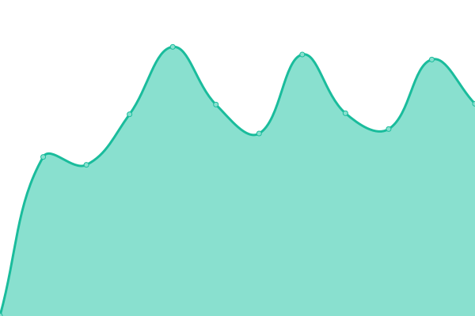 968ms
     
 | 

<a href="https://demo.upptime.js.org/history/cerrajerosfoios-com">100.00%</a>
    

|  [cerrajerosgandia.eu](https://cerrajerosgandia.eu) | 🟩 Up | [cerrajerosgandia-eu.yml](https://github.com/pmo-2025/status-pmo/commits/HEAD/history/cerrajerosgandia-eu.yml) | 

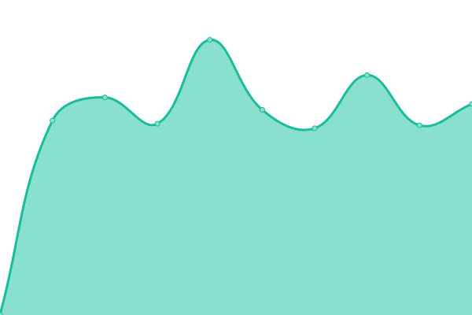 1058ms
     
 | 

<a href="https://demo.upptime.js.org/history/cerrajerosgandia-eu">100.00%</a>
    

|  [cerrajerosgodella.com](https://cerrajerosgodella.com) | 🟩 Up | [cerrajerosgodella-com.yml](https://github.com/pmo-2025/status-pmo/commits/HEAD/history/cerrajerosgodella-com.yml) | 

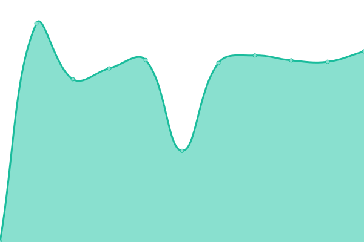 2300ms
     
 | 

<a href="https://demo.upptime.js.org/history/cerrajerosgodella-com">100.00%</a>
    

|  [cerrajeroslaeliana.com](https://cerrajeroslaeliana.com) | 🟩 Up | [cerrajeroslaeliana-com.yml](https://github.com/pmo-2025/status-pmo/commits/HEAD/history/cerrajeroslaeliana-com.yml) | 

 967ms
     
 | 

<a href="https://demo.upptime.js.org/history/cerrajeroslaeliana-com">100.00%</a>
    

|  [cerrajeroslapobladefarnals.com](https://cerrajeroslapobladefarnals.com) | 🟩 Up | [cerrajeroslapobladefarnals-com.yml](https://github.com/pmo-2025/status-pmo/commits/HEAD/history/cerrajeroslapobladefarnals-com.yml) | 

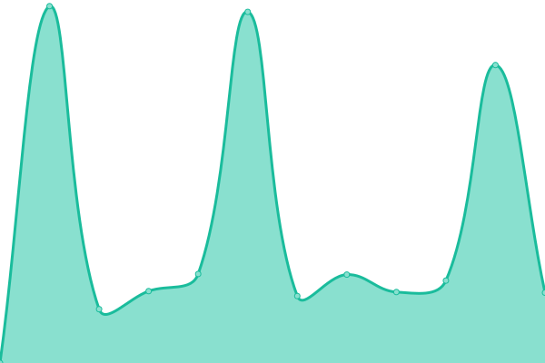 1465ms
     
 | 

<a href="https://demo.upptime.js.org/history/cerrajeroslapobladefarnals-com">100.00%</a>
    

|  [cerrajeroslapobladevallbona.com](https://cerrajeroslapobladevallbona.com) | 🟩 Up | [cerrajeroslapobladevallbona-com.yml](https://github.com/pmo-2025/status-pmo/commits/HEAD/history/cerrajeroslapobladevallbona-com.yml) | 

 1566ms
     
 | 

<a href="https://demo.upptime.js.org/history/cerrajeroslapobladevallbona-com">100.00%</a>
    

|  [cerrajerosliria.com](https://cerrajerosliria.com) | 🟩 Up | [cerrajerosliria-com.yml](https://github.com/pmo-2025/status-pmo/commits/HEAD/history/cerrajerosliria-com.yml) | 

 2441ms
     
 | 

<a href="https://demo.upptime.js.org/history/cerrajerosliria-com">100.00%</a>
    

|  [cerrajerosmassalfassar.com](https://cerrajerosmassalfassar.com) | 🟩 Up | [cerrajerosmassalfassar-com.yml](https://github.com/pmo-2025/status-pmo/commits/HEAD/history/cerrajerosmassalfassar-com.yml) | 

 1256ms
     
 | 

<a href="https://demo.upptime.js.org/history/cerrajerosmassalfassar-com">100.00%</a>
    

|  [cerrajerosmassamagrell.com](https://cerrajerosmassamagrell.com) | 🟩 Up | [cerrajerosmassamagrell-com.yml](https://github.com/pmo-2025/status-pmo/commits/HEAD/history/cerrajerosmassamagrell-com.yml) | 

 2361ms
     
 | 

<a href="https://demo.upptime.js.org/history/cerrajerosmassamagrell-com">100.00%</a>
    

|  [cerrajerosmassanassa.com](https://cerrajerosmassanassa.com) | 🟩 Up | [cerrajerosmassanassa-com.yml](https://github.com/pmo-2025/status-pmo/commits/HEAD/history/cerrajerosmassanassa-com.yml) | 

 969ms
     
 | 

<a href="https://demo.upptime.js.org/history/cerrajerosmassanassa-com">100.00%</a>
    

|  [cerrajerosmeliana.com](https://cerrajerosmeliana.com) | 🟩 Up | [cerrajerosmeliana-com.yml](https://github.com/pmo-2025/status-pmo/commits/HEAD/history/cerrajerosmeliana-com.yml) | 

 2516ms
     
 | 

<a href="https://demo.upptime.js.org/history/cerrajerosmeliana-com">100.00%</a>
    

|  [cerrajerosmoncada.com](https://cerrajerosmoncada.com) | 🟩 Up | [cerrajerosmoncada-com.yml](https://github.com/pmo-2025/status-pmo/commits/HEAD/history/cerrajerosmoncada-com.yml) | 

 2334ms
     
 | 

<a href="https://demo.upptime.js.org/history/cerrajerosmoncada-com">100.00%</a>
    

|  [cerrajerosmuseros.com](https://cerrajerosmuseros.com) | 🟩 Up | [cerrajerosmuseros-com.yml](https://github.com/pmo-2025/status-pmo/commits/HEAD/history/cerrajerosmuseros-com.yml) | 

 972ms
     
 | 

<a href="https://demo.upptime.js.org/history/cerrajerosmuseros-com">100.00%</a>
    

|  [cerrajerospaiporta.com](https://cerrajerospaiporta.com) | 🟩 Up | [cerrajerospaiporta-com.yml](https://github.com/pmo-2025/status-pmo/commits/HEAD/history/cerrajerospaiporta-com.yml) | 

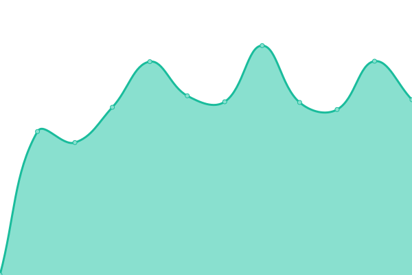 964ms
     
 | 

<a href="https://demo.upptime.js.org/history/cerrajerospaiporta-com">100.00%</a>
    

|  [cerrajerospicanya.com](https://cerrajerospicanya.com) | 🟩 Up | [cerrajerospicanya-com.yml](https://github.com/pmo-2025/status-pmo/commits/HEAD/history/cerrajerospicanya-com.yml) | 

 2289ms
     
 | 

<a href="https://demo.upptime.js.org/history/cerrajerospicanya-com">100.00%</a>
    

|  [cerrajerospicassent.com](https://cerrajerospicassent.com) | 🟩 Up | [cerrajerospicassent-com.yml](https://github.com/pmo-2025/status-pmo/commits/HEAD/history/cerrajerospicassent-com.yml) | 

 975ms
     
 | 

<a href="https://demo.upptime.js.org/history/cerrajerospicassent-com">100.00%</a>
    

|  [cerrajerospuertodesagunto.com](https://cerrajerospuertodesagunto.com) | 🟩 Up | [cerrajerospuertodesagunto-com.yml](https://github.com/pmo-2025/status-pmo/commits/HEAD/history/cerrajerospuertodesagunto-com.yml) | 

 953ms
     
 | 

<a href="https://demo.upptime.js.org/history/cerrajerospuertodesagunto-com">100.00%</a>
    

|  [cerrajerospuzol.com](https://cerrajerospuzol.com) | 🟩 Up | [cerrajerospuzol-com.yml](https://github.com/pmo-2025/status-pmo/commits/HEAD/history/cerrajerospuzol-com.yml) | 

 924ms
     
 | 

<a href="https://demo.upptime.js.org/history/cerrajerospuzol-com">100.00%</a>
    

|  [cerrajerosquartdepoblet.com](https://cerrajerosquartdepoblet.com) | 🟩 Up | [cerrajerosquartdepoblet-com.yml](https://github.com/pmo-2025/status-pmo/commits/HEAD/history/cerrajerosquartdepoblet-com.yml) | 

 1077ms
     
 | 

<a href="https://demo.upptime.js.org/history/cerrajerosquartdepoblet-com">100.00%</a>
    

|  [cerrajerosribarrojadelturia.com](https://cerrajerosribarrojadelturia.com) | 🟩 Up | [cerrajerosribarrojadelturia-com.yml](https://github.com/pmo-2025/status-pmo/commits/HEAD/history/cerrajerosribarrojadelturia-com.yml) | 

 2150ms
     
 | 

<a href="https://demo.upptime.js.org/history/cerrajerosribarrojadelturia-com">100.00%</a>
    

|  [cerrajerosrocafort.com](https://cerrajerosrocafort.com) | 🟩 Up | [cerrajerosrocafort-com.yml](https://github.com/pmo-2025/status-pmo/commits/HEAD/history/cerrajerosrocafort-com.yml) | 

 2759ms
     
 | 

<a href="https://demo.upptime.js.org/history/cerrajerosrocafort-com">100.00%</a>
    

|  [cerrajerossanantoniodebenageber.com](https://cerrajerossanantoniodebenageber.com) | 🟩 Up | [cerrajerossanantoniodebenageber-com.yml](https://github.com/pmo-2025/status-pmo/commits/HEAD/history/cerrajerossanantoniodebenageber-com.yml) | 

 2441ms
     
 | 

<a href="https://demo.upptime.js.org/history/cerrajerossanantoniodebenageber-com">100.00%</a>
    

|  [cerrajerossedavi.com](https://cerrajerossedavi.com) | 🟩 Up | [cerrajerossedavi-com.yml](https://github.com/pmo-2025/status-pmo/commits/HEAD/history/cerrajerossedavi-com.yml) | 

 920ms
     
 | 

<a href="https://demo.upptime.js.org/history/cerrajerossedavi-com">100.00%</a>
    

|  [cerrajerossilla.com](https://cerrajerossilla.com) | 🟩 Up | [cerrajerossilla-com.yml](https://github.com/pmo-2025/status-pmo/commits/HEAD/history/cerrajerossilla-com.yml) | 

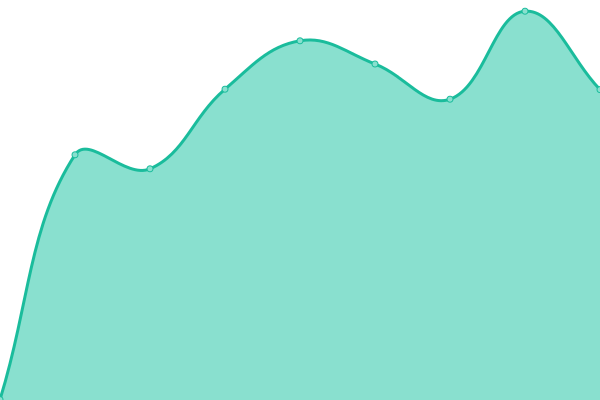 944ms
     
 | 

<a href="https://demo.upptime.js.org/history/cerrajerossilla-com">100.00%</a>
    

|  [cerrajerossollana.com](https://cerrajerossollana.com) | 🟩 Up | [cerrajerossollana-com.yml](https://github.com/pmo-2025/status-pmo/commits/HEAD/history/cerrajerossollana-com.yml) | 

 2873ms
     
 | 

<a href="https://demo.upptime.js.org/history/cerrajerossollana-com">100.00%</a>
    

|  [cerrajerossueca.com](https://cerrajerossueca.com) | 🟩 Up | [cerrajerossueca-com.yml](https://github.com/pmo-2025/status-pmo/commits/HEAD/history/cerrajerossueca-com.yml) | 

 2926ms
     
 | 

<a href="https://demo.upptime.js.org/history/cerrajerossueca-com">100.00%</a>
    

|  [cerrajerostavernesblanques.com](https://cerrajerostavernesblanques.com) | 🟩 Up | [cerrajerostavernesblanques-com.yml](https://github.com/pmo-2025/status-pmo/commits/HEAD/history/cerrajerostavernesblanques-com.yml) | 

 2293ms
     
 | 

<a href="https://demo.upptime.js.org/history/cerrajerostavernesblanques-com">100.00%</a>
    

|  [cerrajerosvillamarchante.com](https://cerrajerosvillamarchante.com) | 🟩 Up | [cerrajerosvillamarchante-com.yml](https://github.com/pmo-2025/status-pmo/commits/HEAD/history/cerrajerosvillamarchante-com.yml) | 

 1223ms
     
 | 

<a href="https://demo.upptime.js.org/history/cerrajerosvillamarchante-com">100.00%</a>
    

|  [cerrajerotavernesblanques.es](https://cerrajerotavernesblanques.es) | 🟩 Up | [cerrajerotavernesblanques-es.yml](https://github.com/pmo-2025/status-pmo/commits/HEAD/history/cerrajerotavernesblanques-es.yml) | 

 1699ms
     
 | 

<a href="https://demo.upptime.js.org/history/cerrajerotavernesblanques-es">100.00%</a>
    

|  [cerrajerotorrent.com](https://cerrajerotorrent.com) | 🟩 Up | [cerrajerotorrent-com.yml](https://github.com/pmo-2025/status-pmo/commits/HEAD/history/cerrajerotorrent-com.yml) | 

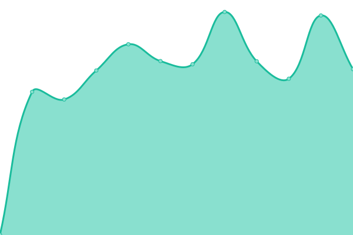 1040ms
     
 | 

<a href="https://demo.upptime.js.org/history/cerrajerotorrent-com">100.00%</a>
    

|  [cerrajerourgentecastellon.com](https://cerrajerourgentecastellon.com) | 🟩 Up | [cerrajerourgentecastellon-com.yml](https://github.com/pmo-2025/status-pmo/commits/HEAD/history/cerrajerourgentecastellon-com.yml) | 

 2392ms
     
 | 

<a href="https://demo.upptime.js.org/history/cerrajerourgentecastellon-com">100.00%</a>
    

|  [cerrajeroxirivella.com](https://cerrajeroxirivella.com) | 🟩 Up | [cerrajeroxirivella-com.yml](https://github.com/pmo-2025/status-pmo/commits/HEAD/history/cerrajeroxirivella-com.yml) | 

 3115ms
     
 | 

<a href="https://demo.upptime.js.org/history/cerrajeroxirivella-com">100.00%</a>
    

|  [cerrajeroxirivella.es](https://cerrajeroxirivella.es) | 🟩 Up | [cerrajeroxirivella-es.yml](https://github.com/pmo-2025/status-pmo/commits/HEAD/history/cerrajeroxirivella-es.yml) | 

 955ms
     
 | 

<a href="https://demo.upptime.js.org/history/cerrajeroxirivella-es">100.00%</a>
    

|  [persianasmotorizadasvalencia.com](https://persianasmotorizadasvalencia.com) | 🟩 Up | [persianasmotorizadasvalencia-com.yml](https://github.com/pmo-2025/status-pmo/commits/HEAD/history/persianasmotorizadasvalencia-com.yml) | 

 997ms
     
 | 

<a href="https://demo.upptime.js.org/history/persianasmotorizadasvalencia-com">100.00%</a>
    

|  [persianaspareja.es](https://persianaspareja.es) | 🟩 Up | [persianaspareja-es.yml](https://github.com/pmo-2025/status-pmo/commits/HEAD/history/persianaspareja-es.yml) | 

 1164ms
     
 | 

<a href="https://demo.upptime.js.org/history/persianaspareja-es">100.00%</a>
    

|  [persianasvalencia.es](https://persianasvalencia.es) | 🟩 Up | [persianasvalencia-es.yml](https://github.com/pmo-2025/status-pmo/commits/HEAD/history/persianasvalencia-es.yml) | 

 1066ms
     
 | 

<a href="https://demo.upptime.js.org/history/persianasvalencia-es">100.00%</a>
    

|  [persianasyautomatismos.com](https://persianasyautomatismos.com) | 🟩 Up | [persianasyautomatismos-com.yml](https://github.com/pmo-2025/status-pmo/commits/HEAD/history/persianasyautomatismos-com.yml) | 

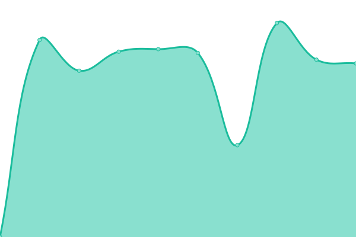 2806ms
     
 | 

<a href="https://demo.upptime.js.org/history/persianasyautomatismos-com">100.00%</a>
    

|  [puertasautomaticasjc.com](https://puertasautomaticasjc.com) | 🟩 Up | [puertasautomaticasjc-com.yml](https://github.com/pmo-2025/status-pmo/commits/HEAD/history/puertasautomaticasjc-com.yml) | 

 1103ms
     
 | 

<a href="https://demo.upptime.js.org/history/puertasautomaticasjc-com">100.00%</a>
    

|  [solopersianas.es](https://solopersianas.es) | 🟩 Up | [solopersianas-es.yml](https://github.com/pmo-2025/status-pmo/commits/HEAD/history/solopersianas-es.yml) | 

 1122ms
     
 | 

<a href="https://demo.upptime.js.org/history/solopersianas-es">100.00%</a>
    

|  [valenciacerrajeros.es](https://valenciacerrajeros.es) | 🟩 Up | [valenciacerrajeros-es.yml](https://github.com/pmo-2025/status-pmo/commits/HEAD/history/valenciacerrajeros-es.yml) | 

 1018ms
     
 | 

<a href="https://demo.upptime.js.org/history/valenciacerrajeros-es">100.00%</a>
    

|  [xn--cerrajerosbuol-1nb.com](https://xn--cerrajerosbuol-1nb.com) | 🟩 Up | [xn-cerrajerosbuol-1nb-com.yml](https://github.com/pmo-2025/status-pmo/commits/HEAD/history/xn-cerrajerosbuol-1nb-com.yml) | 

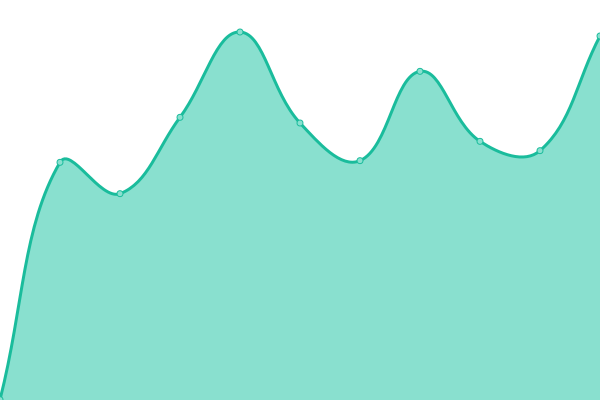 990ms
     
 | 

<a href="https://demo.upptime.js.org/history/xn-cerrajerosbuol-1nb-com">100.00%</a>
    

|  [xn--cerrajeroslacaada-sxb.com](https://xn--cerrajeroslacaada-sxb.com) | 🟩 Up | [xn-cerrajeroslacaada-sxb-com.yml](https://github.com/pmo-2025/status-pmo/commits/HEAD/history/xn-cerrajeroslacaada-sxb-com.yml) | 

 2393ms
     
 | 

<a href="https://demo.upptime.js.org/history/xn-cerrajeroslacaada-sxb-com">100.00%</a>
    

|  [xn--cerrajerosrafelbuol-c4b.com](https://xn--cerrajerosrafelbuol-c4b.com) | 🟩 Up | [xn-cerrajerosrafelbuol-c4b-com.yml](https://github.com/pmo-2025/status-pmo/commits/HEAD/history/xn-cerrajerosrafelbuol-c4b-com.yml) | 

 977ms
     
 | 

<a href="https://demo.upptime.js.org/history/xn-cerrajerosrafelbuol-c4b-com">100.00%</a>
    

<!--end: status pages-->

[**Visit our status website →**](https://demo.upptime.js.org)

## 📄 License

- Powered by: [Upptime](https://github.com/upptime/upptime)
- Code: [MIT](./LICENSE) © [Anand Chowdhary](https://anandchowdhary.com), supported by [Pabio](https://pabio.com)
- Data in the `./history` directory: [Open Database License](https://opendatacommons.org/licenses/odbl/1-0/)
